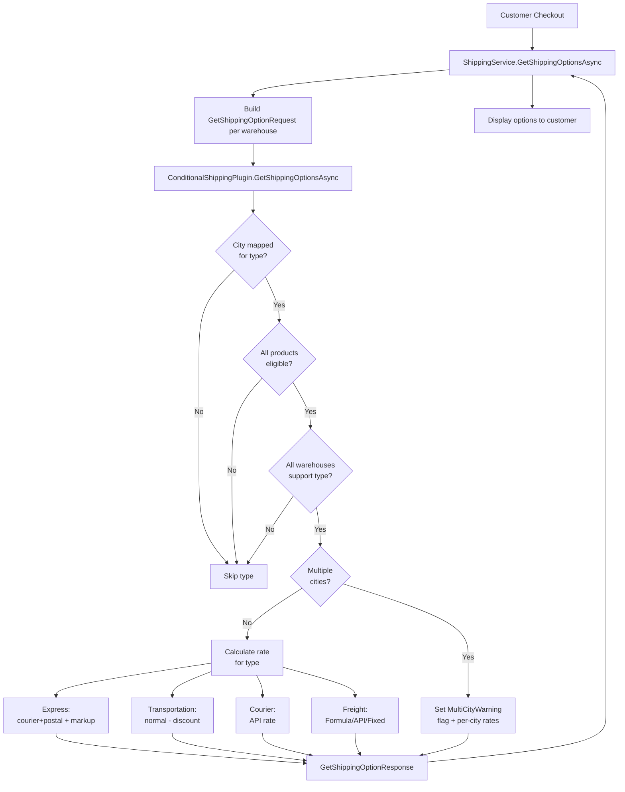

# Conditional Shipping Methods Plugin

## Background & Key Constraints

- nopCommerce has no first-class `City` entity. City is a **string** on `Address.City`. Our plugin introduces its own `ShippingCity` table to store which cities support which shipping types.
- Shipping options are computed via `IShippingRateComputationMethod.GetShippingOptionsAsync(GetShippingOptionRequest)`. The request contains `Items` (with `Product` and warehouse resolution), `ShippingAddress`, and origin fields (`CityFrom`, `WarehouseFrom`, etc.).
- The nopCommerce core merges options from all active providers. Our plugin returns the conditional options it can activate.
- Warehouse addresses are resolved in `ShippingService.CreateShippingOptionRequestsAsync` — each `GetShippingOptionRequest` already carries `CityFrom` (the warehouse/origin city string).

---

## Plugin Structure

```
src/Plugins/Nop.Plugin.Shipping.ConditionalMethods/
├── plugin.json
├── Nop.Plugin.Shipping.ConditionalMethods.csproj
├── ConditionalShippingPlugin.cs          ← BasePlugin + IShippingRateComputationMethod
├── Domain/
│   ├── ConditionalShippingType.cs        ← enum { Courier, Transportation, Freight, Express }
│   ├── ShippingCityMapping.cs            ← entity: ShippingType, CityName, StateProvinceId
│   ├── ShippingProductMapping.cs         ← entity: ShippingType, ProductId
│   ├── ShippingWarehouseMapping.cs       ← entity: ShippingType, WarehouseId
│   └── ConditionalShippingSettings.cs    ← ISettings (per-type cost rules, min/max, API keys)
├── Data/
│   ├── ConditionalShippingSchemaBuilder.cs
│   └── SchemaMigration.cs
├── Services/
│   ├── IConditionalShippingService.cs
│   ├── ConditionalShippingService.cs     ← eligibility checks + cost formulas
│   ├── ICourierApiService.cs
│   ├── CourierApiService.cs              ← stub/real courier API integration
│   ├── IFreightApiService.cs
│   └── FreightApiService.cs             ← stub/real freight API integration
├── Models/
│   ├── ConfigurationModel.cs
│   ├── CityMappingListModel.cs / SearchModel.cs / Model.cs
│   ├── ProductMappingListModel.cs / …
│   └── WarehouseMappingListModel.cs / …
├── Controllers/
│   └── ConditionalShippingAdminController.cs
├── Infrastructure/
│   └── NopStartup.cs
└── Views/
    └── Admin/
        ├── Configure.cshtml
        ├── CityMappings.cshtml
        ├── ProductMappings.cshtml
        └── WarehouseMappings.cshtml
```

---

## Domain Entities

**`ShippingCityMapping`** — which cities support which shipping type:
- `Id`, `ShippingType` (enum int), `CityName` (string), `StateProvinceId` (int, FK), `IsActive`

**`ShippingProductMapping`** — which products are eligible:
- `Id`, `ShippingType`, `ProductId`

**`ShippingWarehouseMapping`** — which warehouses support a type:
- `Id`, `ShippingType`, `WarehouseId`

**`ConditionalShippingSettings`** (ISettings, stored in nop settings table, per-type prefix):
- `Express_Enabled`, `Express_PercentageIncrease`, `Express_FixedAddition`, `Express_MinAddition`, `Express_MaxAddition`, `Express_CourierApiKey`, `Express_PostalBaseRate`
- `Transportation_Enabled`, `Transportation_PercentageDecrease`, `Transportation_FixedDeduction`, `Transportation_MinDeduction`, `Transportation_MaxDeduction`
- `Freight_Enabled`, `Freight_CostMode` (Api/Formula/Fixed), `Freight_FixedRate`, `Freight_MinCostPerKg`, `Freight_MaxCostPerKg`, `Freight_MinCostPerKm`, `Freight_MaxCostPerKm`, `Freight_ApiKey`
- `Courier_Enabled`, `Courier_ApiKey`, `Courier_ApiEndpoint`

---

## Priority Eligibility Logic

For each shipping type, three conditions must ALL pass (evaluated in City → Product → Warehouse order):

```
IsEligible(type, request):
  1. CityCheck: ShippingCityMapping has active row for (type, request.CityFrom, stateProvinceId)
  2. ProductCheck: ALL products in request.Items have a ShippingProductMapping row for type
  3. WarehouseCheck: ALL distinct warehouses in request.Items have a ShippingWarehouseMapping row for type
  → only if 1 AND 2 AND 3 → type is available
```

This runs inside `GetShippingOptionsAsync` on the `GetShippingOptionRequest`.

---

## Cost Calculation per Type

**Express:**
```
base = courierCost + postalBaseRate
addition = Max(MinAddition, Min(MaxAddition,
               base * (PercentageIncrease/100) + FixedAddition))
finalRate = base + addition
```

**Transportation:**
```
base = normalShippingCost  (lowest rate from other active providers, or fixed baseline)
deduction = Max(MinDeduction, Min(MaxDeduction,
                base * (PercentageDecrease/100) + FixedDeduction))
finalRate = Max(0, base - deduction)
```

**Courier:**
```
finalRate = courierApiService.GetRateAsync(request)
```

**Freight/Cargo:**
```
if mode == Api: finalRate = freightApiService.GetRateAsync(request)
if mode == Formula:
  perKg = Clamp(weight * CostPerKg, MinCostPerKg*weight, MaxCostPerKg*weight)
  perKm = Clamp(distance * CostPerKm, MinCostPerKm*distance, MaxCostPerKm*distance)
  finalRate = perKg + perKm
if mode == Fixed: finalRate = FixedRate
```

---

## Multi-Warehouse / Multi-City Handling

Inside `GetShippingOptionsAsync`, after computing per-warehouse requests:

1. **Detect multi-city**: collect distinct city strings from all warehouse origin addresses in the request items.
2. **If single city**: proceed normally.
3. **If multiple cities**:
   - Add a special `ShippingOption` with `Name = "MultiCityWarning"` and a description explaining separate shipments.
   - Return individual city options with summed rates so the customer can choose.
   - The controller/view layer (customer checkout) renders a dismissible warning and the two choices.

Since nopCommerce already supports `ShippingFromMultipleLocations` on `GetShippingOptionResponse`, we set that flag and surface the per-city breakdowns.

---

## Admin UI

The admin controller exposes CRUD grids for:
- **City Mappings**: select shipping type + StateProvince + city string → maps to that type
- **Product Mappings**: select shipping type + search/select product
- **Warehouse Mappings**: select shipping type + select warehouse
- **Configure** page: per-type enable/disable, cost parameters, API keys

All grids use standard nopCommerce `BaseAdminController` + `DataTablesModel` pattern (same as the GroupPurchase plugin's admin views).

---

## Integration Points

- **`IShippingRateComputationMethod`** — [`src/Libraries/Nop.Services/Shipping/IShippingRateComputationMethod.cs`](src/Libraries/Nop.Services/Shipping/IShippingRateComputationMethod.cs)
- **`GetShippingOptionRequest`** — [`src/Libraries/Nop.Services/Shipping/GetShippingOptionRequest.cs`](src/Libraries/Nop.Services/Shipping/GetShippingOptionRequest.cs) (has `CityFrom`, `Items`, `WarehouseFrom`)
- **`IWarehouseService`** — [`src/Libraries/Nop.Services/Shipping/IWarehouseService.cs`](src/Libraries/Nop.Services/Shipping/IWarehouseService.cs) (to resolve warehouse addresses)
- **`StateProvince`** — [`src/Libraries/Nop.Core/Domain/Directory/StateProvince.cs`](src/Libraries/Nop.Core/Domain/Directory/StateProvince.cs) (to populate city mapping dropdowns)
- **Reference plugin** — [`src/Plugins/Nop.Plugin.Shipping.FixedByWeightByTotal/`](src/Plugins/Nop.Plugin.Shipping.FixedByWeightByTotal/) for structural conventions
- **GroupPurchase plugin** — [`src/Plugins/Nop.Plugin.Misc.GroupPurchase/`](src/Plugins/Nop.Plugin.Misc.GroupPurchase/) for `.csproj`, `NopStartup`, and Data migration patterns

---

## Flow Diagram


