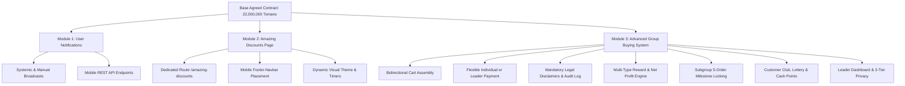
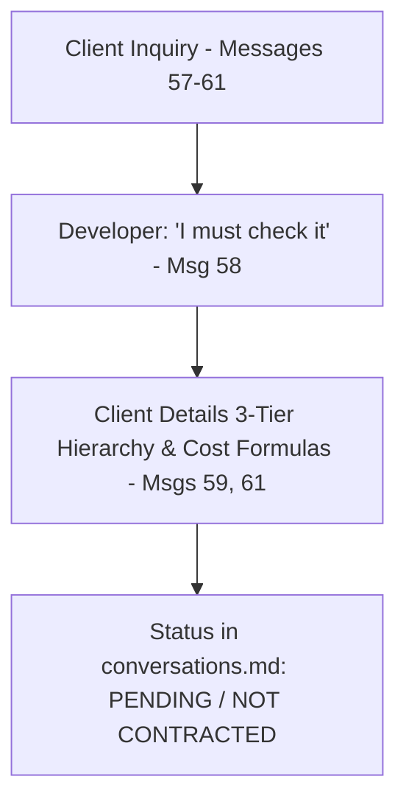

# Master Feature Specification Document (features.md)

This document is the definitive, exhaustive specification of all software features, functional requirements, mathematical formulas, business rules, architectural constraints, and project parameters extracted from the complete conversation transcript in [`docs/conversations.md`](file:///e:/projects/nopCommerce_4.90.3_Source/docs/conversations.md).

> [!IMPORTANT]
> **Contractual Agreement Status Breakdown:**
> * **Part I: Formally Agreed Features (The Base Contract — 22,000,000 Tomans):**
>   * **Module 1:** User Notifications Module & Mobile API (Agreed in Messages 2–12)
>   * **Module 2:** Dedicated "Amazing Discounts" Page & Mobile Footer Nav (Agreed in Messages 2–12, 37)
>   * **Module 3:** Advanced Group Buying Module & Subsystems (Agreed in Messages 2–12, refined in Messages 49–51)
> * **Part II: Proposed / Under Review Feature (Pending Agreement in this Transcript):**
>   * **Module 4:** Multi-Tier Conditional Shipping Engine (Requested by client in Messages 57–61; Developer's recorded status is *"I need to check it"* in Message 58, with no contract or pricing closed in this transcript).

---

## 1. Traceability & Agreement Matrix

| ID | Feature / Module | Agreement Status in `conversations.md` | Primary Message Citations | Financial / Milestone Terms |
| :--- | :--- | :--- | :--- | :--- |
| **MOD-01** | **User Notifications Module & Mobile API** | **AGREED** | Messages 2, 37 | Covered under 22,000,000 Toman Base Contract |
| **MOD-02** | **Dedicated "Amazing Discounts" Page** | **AGREED** | Messages 2, 37 | Covered under 22,000,000 Toman Base Contract |
| **MOD-03** | **Advanced Group Buying Module** | **AGREED** | Messages 2, 37, 47, 49, 50, 51 | Covered under 22,000,000 Toman Base Contract |
| **MOD-04** | **Multi-Tier Conditional Shipping Engine** | **PROPOSED / NOT AGREED** | Messages 57, 58, 59, 60, 61 | Under technical review; no quote or agreement in this file |

---

# PART I: FORMALLY AGREED BASE FEATURES (22,000,000 TOMANS)

---

## Module 1: User Notifications Module & API (AGREED)

### 1.1 Overview & Scope
A centralized communication and announcement module enabling store administrators to publish announcements to general site visitors and registered customers across web and mobile platforms.

### 1.2 Detailed Functional Requirements
1. **Notification Generation Types:**
   * **Systemic Notifications:** Triggered automatically by core system events or automated scheduled tasks.
   * **Admin-Initiated Notifications:** Created manually by administrators via the nopCommerce admin panel.
2. **Scheduling & Publishing Controls:**
   * Announcement title and rich HTML body supporting Persian typography and embedded links.
   * `StartDateUtc` and `EndDateUtc` for automated activation and expiration.
   * `IsPublished` boolean master switch.
   * Optional customer role filtering (e.g., Guest, Registered, Vendor).
3. **Storefront Presentation Modes:**
   * Dismissible top alert banner / strip.
   * Interactive modal popups for high-priority announcements.
   * Public widget injection into widget zones (`header_after`, `home_page_top`).
4. **Mobile Application & REST API Synchronization:**
   * `GET /api/notifications/active`: Delivers active, non-expired announcements within the current UTC window to the mobile app.
   * `POST /api/notifications/mark-read`: Logs notification read state per authenticated customer.

---

## Module 2: Dedicated "Amazing Discounts" Page (`تخفیفات شگفت‌انگیز`) (AGREED)

### 2.1 Overview & Scope
A dedicated promotional landing page and mobile app section designed to feature flash sales, limited-time promotions, and high-discount catalog items.

### 2.2 Detailed Functional Requirements
1. **Application & Web Integration:**
   * Dedicated storefront route: `/amazing-discounts`.
   * **Permanent Mobile Navigation Link:** Prominently featured in the mobile app's **Footer Navigation Bar** (`footer-navbar`) as well as website navigation.
   * **Dynamic High-Converting Visual Theme:**
     * Live countdown clocks showing hours/minutes remaining.
     * Eye-catching discount percentage badges (e.g., `-35%`, `-50%`).
     * Real-time stock progress indicators (e.g., "75% Claimed").
     * Top hero banner / promotional carousel.
2. **Administrative Campaign Management (Admin Back-Office):**
   * Accessible via `Admin → Promotions → Amazing Discounts`.
   * Support for associating products individually or pulling products dynamically via promotional tags.
   * Control over display sequence, custom promotional labels (e.g., "Special Deal", "Limited Stock"), and scheduling windows (Start/End dates).
3. **Mobile API Synchronization:**
   * `GET /api/amazing-discounts`: Delivers structured promotional payloads to the native mobile app, including calculated discount pricing, remaining deal duration, stock levels, and product imagery.

---

## Module 3: Advanced Group Buying Module (`خرید گروهی / خرید اشتراکی`) (AGREED)

### 3.1 Cart Conversion & Assembly Workflows
1. **Entry Points & Unique Shared ID:**
   * Customers can initiate or join group purchases from the **Homepage** ("Start Group Purchase" / "Join Group Purchase") or directly from the **Shopping Cart** page ("Convert to Group Purchase").
   * Once converted, the shopping cart is tagged with a unique, human-readable Group ID (e.g., `GP-XXXXX`) that can be shared with neighbors, colleagues, or friends.
2. **Bidirectional Group Assembly (Clarified in Message 50):**
   * **Member-Initiated Join:** A subgroup member inputs the Leader's Group ID on their cart page to request joining.
   * **Leader-Initiated Add:** The Group Leader can input the shopping cart IDs of prospective members directly from their dashboard.
   * **Reciprocal Confirmation Dialogs:** In both directions, the non-initiating party must receive an interactive confirmation prompt requiring explicit approval or rejection before their cart is merged.
3. **Flexible Payment Modes (Clarified in Message 50):**
   * **Mode A (Decentralized Payment):** Each group participant pays for their individual shopping cart through standard checkout.
   * **Mode B (Consolidated Leader Payment):** The Group Leader elects to pay the full cumulative total for all merged shopping carts in a single transaction.

---

### 3.2 Legal Liability Disclaimers & Audit Logging
To prevent shipping disputes when consolidating neighborhood orders to a single physical address, mandatory legal acknowledgments must be recorded:

1. **Group Leader Liability Modal:**
   * **Displayed Message:** Informs the leader that they assume legal and physical responsibility for receiving all goods on behalf of subgroup members in their vicinity (same building, complex, or alley) if those members are absent. In exchange, the leader receives rewards (wallet top-ups, discounts, free shipping).
   * **Mandatory Action:** An explicit *"I Accept"* (`می‌پذیرم`) checkbox/button must be clicked to complete group conversion.
   * **Admin Customizability:** Disclaimer text must be 100% editable by the administrator in the admin settings.
2. **Subgroup Member Delivery Modal:**
   * **Displayed Message:** Discloses that ordered items will be delivered to the Group Leader (`[Leader Name]`) at (`[Leader Address]`). If the member is present and nearby, the courier will hand over the items directly; otherwise, the parcel is held safely by the leader. Highlights group discounts and rewards.
   * **Mandatory Action:** An explicit *"I Accept"* (`می‌پذیرم`) checkbox/button must be clicked to join.
3. **Permanent Legal Audit Logging:**
   * Every consent confirmation is recorded in `GP_LegalConfirmationLog` capturing:
     * `CustomerId`, `GroupPurchaseId`, `Role` (Leader / Subgroup)
     * `MessageShown` (Exact snapshot of text displayed)
     * `AcceptedOnUtc` (Timestamp)
     * `IPAddress` & User Agent

---

### 3.3 Multi-Tier Commission & Reward Engine
An administrative configuration engine allowing store managers to set up customized incentives for Leaders and Subgroup Members:

#### A. Supported Reward Types
The administrator can independently configure which incentives apply to Leaders vs. Subgroups:
1. **Wallet Balance Credit (`شارژ کیف پول`):** Direct credit to the customer's store wallet.
2. **Immediate Cart Discount (`تخفیف در سبد خرید`):** Instant percentage or fixed reduction on the current order.
3. **Next-Order Discount Voucher (`تخفیف در خرید بعدی`):** Automated promo code issued for future purchases.
4. **Promotional Gift / Freebie (`اشانتیون`):** Complimentary bonus item automatically added to the shipment.
5. **Store Gift Card (`کارت هدیه`):** Digital gift certificate issued to the account.
6. **Discount + Free Courier Delivery (`تخفیف و پیک رایگان`):** Combined price discount with zero delivery charge.
7. **Courier Delivery Subscription Pass (`هدیه اشتراک پیک`):** Period-based free delivery pass (e.g., 30 days of free courier deliveries).

#### B. Calculation Methods
* **Fixed Amount:** Specified monetary sum (e.g., 50,000 Tomans).
* **Percentage of Cart Total:** Computed against gross cart value.
* **Percentage of Net Profit:** Computed against store net profit.
  * **Critical Accounting Rule:** If subgroup members utilized individual discount codes or promotions, those discounts must be deducted from the gross profit before computing profit-based leader commissions:
  $$\text{Net Profit for Rewards} = \text{Total Gross Profit} - \sum (\text{Subgroup Member Discounts})$$

#### C. Category-Specific Commission Rates
Commission percentages must vary dynamically by product category, managed via the admin panel:
* *Example:* Supermarket category = **4% to 5%** of cart total credited to leader wallet; Digital Electronics = **0.5%**.

#### D. Qualification Thresholds & Sliding Scales
* Minimum purchase amount per cart to qualify for group purchase benefits.
* Maximum reward caps per order or per customer.
* **Sliding Scale Discount:** e.g., For every 1,000,000 Tomans in subgroup sales, 0.5% discount added to the leader's cart, up to a maximum cap of 50% of total profit.

#### E. Tiered Group Size Bonuses
Special bonus points awarded when group member counts hit specific thresholds:
| Group Size Tier | Bonus Points Awarded per Member |
| :--- | :--- |
| **10 Members** | +1 Point |
| **20 Members** | +2 Points |
| **30 Members** | +3 Points |
| **40 Members** | +4 Points |
| **50+ Members** | +5 Points |

---

### 3.4 Subgroup Milestone Locking Mechanism
To foster repeat customer loyalty among subgroup members:
* Subgroup members accumulate rewards (e.g., 4% to 5% cashback on their purchases).
* **Milestone Locking:** This cashback balance is visible in the member's wallet, but **strictly locked and unusable** until the member achieves a designated participation milestone (e.g., **5 completed group purchases**).
* **Automated Notification:** When the member completes their 5th group purchase, the system sends an automated notification announcing the balance is unlocked.
* **Redemption:** The unlocked funds can be applied toward their 6th group purchase, spent on a standalone solo purchase, or converted into lottery points.
* *Accounting Note:* Subgroup rewards are treated as store discounts and deducted from total net profit.

---

### 3.5 Customer Club, Wallet & Lottery Draw Integration
A gamification and loyalty subsystem integrated with group purchases:

1. **Customer Club Portal:**
   * Located under `Customer → My Account → Customer Club`.
   * Displays accumulated points, monetary earnings from group buys, upcoming draw dates, and prize catalogs.
2. **Dual-Utility Points System:**
   * Points can be spent directly as wallet currency OR redeemed as entries in scheduled lottery prize draws:
     $$\text{1 Lottery Point} = \text{1 Draw Chance} \quad\text{OR}\quad \text{20,000 Tomans in Wallet Balance}$$
   * Purchase-to-point ratios: e.g., 1,000,000 Tomans in group spend = 1 point (configurable per product category, e.g., 5,000,000 Tomans in electronics = 1 point).
3. **Strict Separation of Funds:**
   * **Crucial Security & Fraud Prevention Rule:** Only earnings derived from Group Purchases, referral rewards, and approved promotional programs can be converted into lottery points. **Regular cash wallet deposits made via bank payment gateways CANNOT be converted into lottery points.**
4. **Referral Bonus Program:**
   * Registering a customer with a referral link where the referee completes a purchase of at least 1,000,000 Tomans automatically awards **1 Lottery Point** to the referrer.

---

### 3.6 User Dashboard & Member Privacy Settings
A dedicated portal under `Customer → My Account → Group Purchases` with two distinct tabs:

#### A. Leader Dashboard Tab
* Order history table displaying: Group purchase date, participant names, individual cart totals, combined group spend, participation frequency count per member, and cart statuses.
* Advanced query and filtering tools (filter by date range, member name, status).

#### B. Member Privacy Settings & Absence Exception
Subgroup members can choose how much cart information is visible to the Group Leader:
1. **Full Visibility (`نمایش کامل`):** Leader sees complete product names, quantities, and prices.
2. **Limited Visibility (`نمایش محدود`):** Leader sees only item counts (e.g., "5 items"), without product titles.
3. **Hidden (`عدم نمایش`):** Leader sees only total price and weight.
* **Emergency Absence Fallback Rule:** If a subgroup member is not present at the time of delivery to receive their parcel, the system automatically elevates the Group Leader's permission to inspect all ordered items in that parcel to verify and confirm receipt from the courier. This rule is accepted during join consent.

#### C. Cross-City Shipping Rule
* Customers residing in different neighborhoods or cities may join the same group buy; however, **free courier delivery is automatically revoked**, and standard calculated shipping fees apply to all members.

---

# PART II: PROPOSED / UNDER REVIEW FEATURE (PENDING AGREEMENT)

## Module 4: Multi-Tier Conditional Shipping Engine (`ارسال شرطی`) (PROPOSED)

### 4.1 Concept & 3-Tier Prioritized Evaluation
The client proposed creating conditional shipping methods (such as **Express Delivery / ارسال فوری**) that activate dynamically during checkout if and only if operational conditions are satisfied across a strict 3-tier hierarchy:

1. **Tier 1 — Origin City Courier Coverage:**
   * The origin city must have active local courier service (verified against the Courier / Peyk module).
2. **Tier 2 — Product Support:**
   * All items selected in the shopping cart must be flagged as supporting express shipping.
3. **Tier 3 — Warehouse Support:**
   * The specific storage warehouses fulfilling the order must support express dispatch.

### 4.2 Dynamic Cost Calculation Engine
When Express Delivery is activated, its shipping fee is dynamically calculated:
* **Base Shipping Cost:**
  $$\text{Base Cost} = \text{Courier Fee (from Courier Module)} + \text{Postal/Tipax Fee (from Post API / Algorithm)}$$
* **Express Surcharge Options (Admin Configurable):**
  1. **Percentage Markup:** e.g., 25% higher than regular shipping.
  2. **Fixed Surcharge:** e.g., Base shipping + X Tomans.
  3. **Hybrid Formula:** (Base Shipping × Percentage Markup) + Fixed Surcharge.
  4. **Boundary Enforcements:** Admin can enforce Minimum and Maximum surcharge limits (e.g., surcharge cannot be less than 20,000 or greater than 100,000 Tomans).

### 4.3 Multi-Warehouse / Multi-City Conflict Handling
If an order satisfies all 3 tiers, but products are sourced from warehouses located across **multiple different cities**, the system detects the physical logistics conflict and offers the customer two clear choices:

* **Choice 1 (Cart Correction):**
  * Displays a notification explaining that express delivery requires products to originate from warehouses within a single city, prompting the user to modify their cart.
* **Choice 2 (Split Multi-Shipment Invoicing):**
  * System permits multi-city dispatch, generating separate shipping calculations per city warehouse, displaying an itemized shipping fee breakdown per city, and presenting the combined grand total shipping fee for customer approval.

---

## 2. Operational, Project & Platform Requirements

### 2.1 Target Platforms & Dual Compatibility
* **nopCommerce 4.90:** Modern .NET Core 8 / 9 target architecture used as the primary source code baseline.
* **nopCommerce 3.9 (ForoshGostar Core):** Legacy .NET Framework custom distribution in production on the client's store ([ForoshGostar Documentation](https://docs.foroshgostar.com/developers/)).
* **Requirement:** Modules must maintain architectural compatibility across nopCommerce versions 3.9 through 4.90, adhering to nopCommerce plugin specifications without modifying core source code.

### 2.2 Agreed Project Schedule & Timeline (Message 11)
* **15 Days:** Complete core plugin coding and feature implementation.
* **5 Days:** Developer self-testing on nopCommerce 3.9 & 4.90 platforms.
* **5 Days:** Joint live/staging testing on client environment.
* **5 Days:** Debugging, adjustments, and final delivery.
* **Post-Delivery:** 12 months technical support commitment (Message 15).

### 2.3 Financial Escrow Terms (Messages 6–10)
* Total base project value: **22,000,000 Tomans**.
* **Phase 1 Escrow Deposit:** 30% (**6,000,000 Tomans**) deposited upfront (completed).
* **Phase 2 Escrow Release:** 70% (**15,000,000 Tomans**) upon project code completion.
* **Final Release:** **7,000,000 Tomans** released following comprehensive live testing and handover.

### 2.4 Environmental & Network Notes (Messages 52–56)
* Client noted temporary internet infrastructure disruptions and recommended applying for International Internet / Trade Association VPN access (*نظام صنفی رایانه‌ای*) if needed to maintain development momentum.
