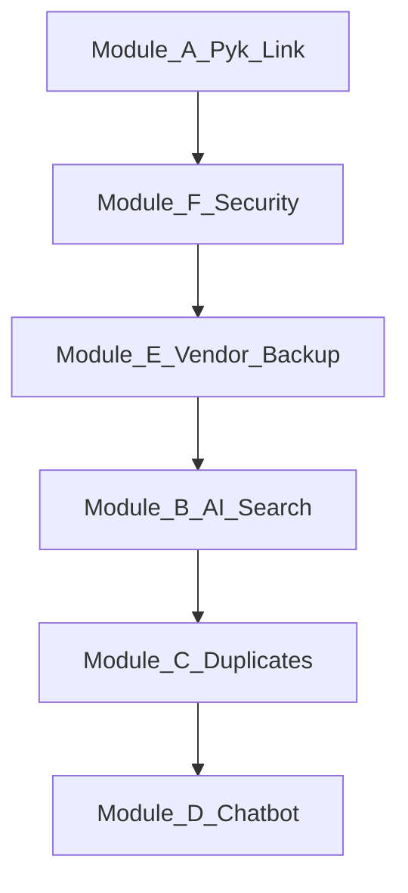

# Phase 2 — Modular Enhancement Proposal

**Project:** nopCommerce 4.90 Marketplace (delivered Phase 1)  
**Document type:** Client proposal — optional add-on modules  
**Version:** 1.0

---

## Executive summary

Phase 1 delivered a production-ready **nopCommerce 4.90.3** marketplace with custom plugins (Group Purchase, Amazing Discounts, User Notifications, Conditional Shipping) and built-in multi-vendor support.

Phase 2 covers **new features** requested after delivery. Each module below can be purchased **independently** or as a phased program. Modules are ordered by risk, dependency, and time-to-value.

| Module | Name | Effort | Dependency |
|--------|------|--------|------------|
| **A** | Pyk PWA header link | 1–2 days | Client assets |
| **B** | Visual + voice AI product search | 3–6 weeks | AI API account |
| **C** | AI duplicate product detection | 4–8 weeks | Questionnaire §04 |
| **D** | AI customer chatbot | 2–5 weeks | AI API account |
| **E** | Vendor backup / restore + admin approval | 3–5 weeks | Questionnaire §03 |
| **F** | SMS 2FA + enhanced access control | 1.5–3 weeks | SMS gateway account |
| — | Global admin IP allowlist | **Already included** | Configuration only |

**Not feasible as specified:** MAC address restriction for web admin — see [01-mac-address-admin-security-note.md](./01-mac-address-admin-security-note.md).

---

## Phase 1 vs Phase 2 (what you already have)

| Capability | Phase 1 (delivered) | Phase 2 (this proposal) |
|------------|---------------------|-------------------------|
| Multi-vendor marketplace | Yes | — |
| Text product search | Yes | AI visual/voice search (B) |
| Admin AI (descriptions, SEO) | Yes (nop 4.90) | Storefront AI search/chat (B, D) |
| Google Authenticator MFA | Yes | SMS MFA (F) |
| Admin IP allowlist (global) | Yes | Per-user IP / device binding (F) |
| Full DB backup (admin, SQL Server) | Yes | Per-vendor backup/restore (E) |
| Duplicate product handling | Manual copy / SKU import only | AI detection + review queue (C) |
| Link to external mobile app | No | Pyk PWA button (A) |

The **harajbozorg** APK in the project folder is a **reference mobile app**, not source code in this repository. It may inform UX expectations; it does not obligate Phase 1 to include its features.

---

## Recommended rollout

1. **Quick win:** A + configure existing IP allowlist  
2. **Security & ops:** F, then E  
3. **AI (highest variable cost):** B → C → D  

---

## Module A — Pyk PWA header link

**Fixed-price quote:** [02-quote-pyk-header-link.md](./02-quote-pyk-header-link.md)

| | |
|---|---|
| **Goal** | Header button/icon opens Pyk mobile PWA |
| **Effort** | 4–12 hours |
| **Client provides** | Pyk URL, icon, label, open-behavior preference |

---

## Module B — Visual + voice AI product search

### Goal

Shoppers search the catalog by **text**, **voice** (speech-to-text), and **image** (upload/camera), with AI-backed ranking — beyond standard keyword search.

### Deliverables

- Storefront UI: microphone control, image upload/camera, results view  
- Backend plugin: search API, integration with catalog  
- AI pipeline: speech-to-text (Persian-capable), image similarity / embeddings, optional LLM query understanding  
- Admin settings: API keys, enable/disable modes, similarity thresholds  
- Indexing job for product images and metadata  

### Technical notes

- Current search: SQL keyword match in `ProductService.SearchProductsAsync`  
- Admin `ArtificialIntelligenceService` is **not** reused for storefront search — new integration required  
- Lucene plugin in repo is placeholder only  

### Effort

| Tier | Scope | Duration |
|------|-------|----------|
| B1 — MVP | Voice OR image + text fallback, cloud APIs | 3–4 weeks |
| B2 — Full | Voice + image + re-ranking, Persian tuning | 5–6 weeks |

### Ongoing costs (client-paid API)

| Service | Typical use | Order of magnitude |
|---------|-------------|-------------------|
| Speech-to-text (Google/Azure/OpenAI) | Per voice search | $0.006–0.02 per request |
| Vision / embeddings (OpenAI, Google) | Per image search + index | $0.01–0.05 per image query; indexing once per product image |
| LLM query parsing (optional) | Per complex query | $0.001–0.01 per request |

**Example:** 10,000 image searches/month ≈ $100–500 depending on provider and image size. **Client should budget monthly AI spend separately from development fee.**

### Acceptance criteria

- User can complete voice search in Persian (or agreed language) and see relevant products  
- User can upload/take photo and see top N similar products  
- Admin can disable modules independently  
- Response time under agreed SLA (e.g. &lt; 5 s P95 on staging)

---

## Module C — AI duplicate product detection

**Scope questionnaire:** [04-questionnaire-duplicate-detection-scope.md](./04-questionnaire-duplicate-detection-scope.md)

### Goal

On product create/edit (and optionally import), system flags likely duplicates; admin reviews matches and merges or updates.

### Deliverables

- Product fingerprint index (text + image embeddings)  
- Detection service on configured triggers  
- Admin “Duplicate review” queue with side-by-side comparison  
- Actions: dismiss, merge, edit, delete per agreed policy  
- Audit log of decisions  

### Effort

| Tier | Scope | Duration |
|------|-------|----------|
| C1 | Same-vendor, name + SKU + basic image | ~4 weeks |
| C2 | + AI image + Persian text | ~5–6 weeks |
| C3 | + Cross-vendor + import hooks | ~7–8 weeks |

### Ongoing costs

- Initial catalog indexing: one-time API charge (scales with product count)  
- Per new/edited product: embedding + comparison (~$0.001–0.02 per check)

### Prerequisites

- Completed questionnaire §04  
- Decision on cross-vendor matching and merge rules  

---

## Module D — AI customer chatbot

### Goal

Customer-facing assistant for product discovery, FAQs, shipping/policy questions — integrated with your catalog.

### Tiers

| Tier | Description | Effort |
|------|-------------|--------|
| D1 — Embedded | Third-party widget (Tawk, Crisp, etc.) + custom styling | 1–3 days |
| D2 — RAG plugin | Custom widget, catalog/policy retrieval, LLM answers | 3–5 weeks |
| D3 — Agent | Order lookup, cart actions, account-aware | 6+ weeks |

**Recommendation:** Start D2; expand to D3 after B/C data pipelines exist.

### Ongoing costs

- LLM tokens: ~$0.01–0.10 per conversation (model-dependent)  
- Optional: vector DB hosting if catalog is large  

### Guardrails (included in D2+)

- No hallucinated prices — answers cite live product data  
- Escalation to human / contact form  
- Rate limiting and content filtering  

---

## Module E — Vendor backup & restore (admin approval)

**Scope questionnaire:** [03-questionnaire-vendor-backup-scope.md](./03-questionnaire-vendor-backup-scope.md)

### Goal

Each vendor exports their data from admin panel; restore requires **admin approval** before apply.

### Deliverables

- Vendor UI: Create backup, download, request restore, history  
- Admin UI: Approve/reject restore, preview diff (scope-dependent)  
- Packaged export (ZIP: JSON/XML + media)  
- Transactional restore with rollback on failure  
- Audit trail  

### Recommended v1 scope

Products, images, attributes, inventory, vendor profile — **exclude orders** unless legal review completed.

### Effort

| Tier | Scope | Duration |
|------|-------|----------|
| E1 | Catalog + media + vendor profile | ~3 weeks |
| E2 | + Discounts, shipping rules | ~4 weeks |
| E3 | + Orders / customer PII | ~5 weeks + compliance |

### Infrastructure

- Disk or blob storage for backup files; retention policy per questionnaire  
- Size limits to prevent server fill (configurable)  

---

## Module F — SMS 2FA + enhanced access control

**MAC note:** [01-mac-address-admin-security-note.md](./01-mac-address-admin-security-note.md)

### Goal

- SMS one-time code on login for administrators (and optionally vendors)  
- Stronger access control than password alone  

### Deliverables

| Item | Included |
|------|----------|
| SMS MFA plugin (`IMultiFactorAuthenticationMethod`) | Yes |
| OTP generation, expiry, rate limiting | Yes |
| Phone number verification per user | Yes |
| Admin config: provider credentials, templates, force-MFA for roles | Yes |
| Per-user IP allowlist (optional add-on) | Optional |
| Registered device / browser token (MAC alternative) | Optional |

### Already included (no dev fee)

- **Global** admin IP allowlist: Configuration → General → Security  

### SMS provider (client account)

| Provider | Region | Notes |
|----------|--------|-------|
| Kavenegar, Melipayamak, etc. | Iran | Typical for local market |
| Twilio | International | MFA + transactional |

**SMS cost:** Billed per message by provider (e.g. ~50–200 IRR–equivalent per OTP depending on plan). Not included in development quote.

### Effort

| Package | Contents | Duration |
|---------|----------|----------|
| F1 | SMS 2FA plugin + admin UI | 1–2 weeks |
| F2 | F1 + per-user IP rules | +3–5 days |
| F3 | F2 + registered device binding | +1–2 weeks |

---

## Pricing summary (development — fill in your rates)

| Module | Effort | Suggested pricing model |
|--------|--------|-------------------------|
| A | 1–2 days | **Fixed price** — see quote doc |
| B | 3–6 weeks | Milestone: MVP → UAT → production |
| C | 4–8 weeks | Milestone: index → detect → admin UI → merge |
| D | 2–5 weeks | Tier D1/D2/D3 |
| E | 3–5 weeks | Tier E1/E2/E3 after questionnaire |
| F | 1.5–3 weeks | Package F1/F2/F3 |

### Bundle discount (optional)

| Bundle | Modules | Suggested discount |
|--------|---------|-------------------|
| Security + ops | A + F + E | 5–10% |
| Full AI suite | B + C + D | 10–15% (single indexing pipeline) |
| Complete Phase 2 | A–F | 15% max — only if questionnaires signed |

---

## Client dependencies (all modules)

| Dependency | Modules |
|------------|---------|
| Pyk URL, icon, copy | A |
| OpenAI / Gemini / DeepSeek API keys + budget | B, C, D |
| SMS gateway account | F |
| Completed backup questionnaire | E |
| Completed duplicate questionnaire | C |
| Staging environment for UAT | All |
| Decision on MAC → device binding or VPN | F |

---

## Payment & delivery terms (suggested)

- **Per module:** 40% kickoff, 30% staging UAT, 30% production  
- **Change requests:** Hourly or CR document outside signed scope  
- **Warranty:** 30-day defect fix on delivered scope  
- **API/SMS charges:** Client responsibility, direct to provider  

---

## Sample email to client

Subject: **Phase 2 optional enhancements — modules and next steps**

> Thank you for your follow-up requests. The marketplace delivered in Phase 1 is complete for our agreed scope. The features below are **Phase 2 add-ons**, quoted modularly:
>
> 1. **Pyk link** — small fixed-price item ([quote attached](./02-quote-pyk-header-link.md))  
> 2. **AI visual/voice search** — custom module B  
> 3. **AI duplicate detection** — custom module C ([questionnaire attached](./04-questionnaire-duplicate-detection-scope.md))  
> 4. **AI chatbot** — module D  
> 5. **Vendor backup/restore** — module E ([questionnaire attached](./03-questionnaire-vendor-backup-scope.md))  
> 6. **SMS 2FA** — module F; **admin IP restriction already exists** in your panel; **MAC filtering is not possible on web** ([technical note attached](./01-mac-address-admin-security-note.md))
>
> Please review the attached proposal and return the two questionnaires so we can finalize pricing for C and E. We can start Module A and F as soon as you confirm.

---

## Document index

| File | Purpose |
|------|---------|
| [01-mac-address-admin-security-note.md](./01-mac-address-admin-security-note.md) | MAC vs IP vs device binding |
| [02-quote-pyk-header-link.md](./02-quote-pyk-header-link.md) | Fixed quote Module A |
| [03-questionnaire-vendor-backup-scope.md](./03-questionnaire-vendor-backup-scope.md) | Scope Module E |
| [04-questionnaire-duplicate-detection-scope.md](./04-questionnaire-duplicate-detection-scope.md) | Scope Module C |
| [05-phase2-modular-proposal.md](./05-phase2-modular-proposal.md) | This document |

---

## Sign-off

| Module(s) approved | |
|--------------------|---|
| Total development budget | |
| Target start date | |
| Client signature / date | |
