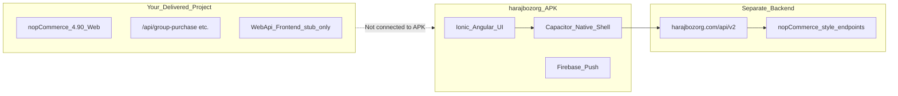

# harajbozorg APK — Technical Analysis

**File:** `harajbozorg/harajbozorg.com-1.apk` (~12 MB)  
**Analysis method:** Static extraction (APK as ZIP) + JavaScript bundle inspection  
**Simulator note:** No Android SDK/emulator is installed on the build machine. The embedded web app was also served locally (`python -m http.server` on the extracted `assets/public` folder). The UI shell loads, but catalog/cart/login require the live backend at `harajbozorg.com` — those API calls cannot be replayed offline.

---

## Executive summary

The harajbozorg APK is **not part of your delivered nopCommerce source code**. It is a **ForoshGostar FGMobile** commercial mobile shell (v6.1.1) — an **Ionic + Angular + Capacitor** app that talks to **`https://www.harajbozorg.com/api/v2`** (and `/api/v9`).

It is best understood as a **reference for what the client wants Pyk to look and behave like**: a Persian RTL mobile storefront PWA/APK — **not** as proof that AI search, chatbot, duplicate detection, or vendor backup already exist.



---

## Identity and publisher

| Field | Value |
|-------|-------|
| App name | حراج بزرگ (Haraj Bozorg) |
| Package ID | `com.foroshgostar.harajbozorg` |
| Platform | ForoshGostar FGMobile **6.1.1** (release 2025-11-30) |
| Developer | فروش گستر — [foroshgostar.com](https://www.foroshgostar.com) |
| Store owner | حراج بزرگ — [harajbozorg.com](https://www.harajbozorg.com) |
| App type | Capacitor hybrid (web app inside native wrapper) |

Embedded config extracted from `main.*.js` is saved at [`harajbozorg/apk-analysis/embedded-configs.json`](../apk-analysis/embedded-configs.json).

---

## Technology stack

| Layer | Technology |
|-------|------------|
| UI framework | Ionic + Angular (lazy-loaded chunks, `app-root`) |
| Native bridge | Capacitor (camera, geolocation, push, browser, share, etc.) |
| Legacy bridge | Cordova plugins (advanced HTTP, Google Analytics, file, in-app browser) |
| Offline/PWA | Angular Service Worker (`ngsw-worker.js`, `manifest.json`) |
| Push | Firebase Cloud Messaging (`@capacitor-community/fcm`) |
| Maps | Leaflet + OpenStreetMap tiles |
| Typography / RTL | IRANSans, `--app-direction: rtl` |
| Brand colors | Primary `#ef394e` (Digikala-style red) |

---

## Backend API (live server — not your repo)

| Setting | Value |
|---------|-------|
| `mainUrl` | `https://www.harajbozorg.com` |
| REST base | `{mainUrl}/api/v2` |
| Secondary API | `{mainUrl}/api/v9` |
| Auth scheme | Basic (`athorizationScheme: "Basic"`) |
| Deep link scheme | `harajbozorgcomapp://` |

### Sample endpoints (nopCommerce-shaped)

These paths appear in the APK bundles and match **standard nopCommerce storefront controller routes**, wrapped by ForoshGostar’s mobile API:

```
Customer/Login
cart/add
cart/getitems
cart/paymentmethods
cart/placeordernew
cart/shipping
orders/get
commission/OrderList
BackInStockSubscription/CustomerSubscriptions
DeliverySchedulingApi/LoadOrderSummaryDeliveryDateTime
```

Full list: [`harajbozorg/apk-analysis/api-endpoints.txt`](../apk-analysis/api-endpoints.txt)

**Implication:** harajbozorg’s mobile app expects a **nopCommerce-compatible HTTP API**, likely provided by ForoshGostar’s commercial mobile middleware — **not** by the stub `Nop.Plugin.Misc.WebApi.Frontend` in your repo (that plugin is admin-only marketing; full Web API must be purchased separately from nopCommerce).

---

## Features present in the APK

| Feature | Evidence | Notes |
|---------|----------|-------|
| Mobile storefront (home, categories, product) | Routes: `home`, `product`, `categories`, `cart` | Standard e-commerce |
| Persian RTL UI | IRANSans, RTL CSS variables | Same market as your store |
| Text search | `ion_searchbar` component | **Not** AI semantic search |
| QR code scanner | Route `qr-code-scanner`, Capacitor camera | Barcode/QR — **not** visual AI product search |
| SMS / OTP verification | Route `mobile-verify-token`, `ion-input-otp` chunks | Phone verification flow |
| 2FA-related UI chunks | Lazy chunks with `2fa` | Login hardening (platform-level) |
| Push notifications | FCM plugin | Topic: `harajbozorgcomapp` |
| Product compare | `product-compare` route | |
| Wish list, reward points, return requests | Routes in bundle | |
| Commissions | `commissions` route | `commissionsEnabled: false` in this build |
| Geofencing | Config present, disabled | |
| Map / pick location | `select-location-on-map`, Leaflet | |
| Add to cart from product image | `addToCardFromProductPic: true` | |

---

## Features the client asked for — **not** found in APK

| Client Phase 2 request | Found in harajbozorg APK? |
|------------------------|---------------------------|
| AI visual product search | **No** — only QR scanner + text searchbar |
| AI voice product search | **No** |
| AI duplicate product detection | **No** — code hits for "duplicate" are Ionic OTP UI warnings, not catalog logic |
| AI chatbot | **No** |
| Vendor backup/restore with admin approval | **No** |
| MAC address admin restriction | **No** (not applicable to mobile app) |
| Pyk header button on main website | **N/A** — this APK *is* the mobile app side |

**Important correction:** Several earlier keyword hits (`duplicate`, `restore`, `sms`) come from **framework code** (Ionic OTP, refresher, Angular internals), not from business features.

---

## Relation to your delivered nopCommerce project

| Area | harajbozorg APK | Your project |
|------|-----------------|--------------|
| Codebase | Separate ForoshGostar product | nopCommerce 4.90.3 + 4 custom plugins |
| Mobile client | Complete Ionic/Capacitor app in APK | No mobile app source; `NopMobileApp` plugin is admin stub |
| Store API | `/api/v2` on harajbozorg.com | Web API not included; partial custom JSON APIs (`/api/group-purchase`, `/api/notifications`, etc.) |
| Group Purchase / Amazing Discounts | Not in APK | Custom plugins in your repo |
| Multi-vendor | Commissions route exists but disabled | Built-in vendor admin |
| AI (search, chat, duplicates) | Absent | Admin AI for descriptions/SEO only |

### What the client likely means by supplying this APK

1. **“We want Pyk to work like harajbozorg”** — mobile-first PWA/APK with Persian UI, cart, checkout, push.
2. **“Match this UX”** — not “copy this codebase into our repo.”
3. **Phase 2 AI/security/backup items are aspirations** — they are **not demonstrated** in the reference app.

---

## Three realistic paths for Pyk (updated Module A)

| Option | Description | Effort |
|--------|-------------|--------|
| **A1 — Link only** | Header button on main nopCommerce site → opens Pyk/FGMobile URL | 1–2 days |
| **A2 — ForoshGostar license** | Client licenses FGMobile from ForoshGostar, points it at **their** nopCommerce URL | Commercial license + config; your work = backend compatibility + custom API for Group Purchase |
| **A3 — Custom Capacitor app** | New Ionic/Capacitor PWA against nopCommerce Web API + your custom endpoints | 8–16+ weeks for parity with harajbozorg feature set |

---

## Local simulation instructions (for your team)

If you install Android Studio or run in Chrome:

1. Extract APK (already done under `harajbozorg/_apk_extracted/`).
2. Serve web assets: `python -m http.server 8765 --directory harajbozorg/_apk_extracted/assets/public`
3. Open `http://localhost:8765` — UI bootstraps but **data calls fail** unless `mainUrl` is repointed to a working API.
4. For full behavior, install APK on device/emulator **with internet** — it will call live `harajbozorg.com`.

---

## Artifacts produced by this analysis

| File | Contents |
|------|----------|
| [`apk-analysis/embedded-configs.json`](../apk-analysis/embedded-configs.json) | Parsed `mainUrl`, version, owner, feature flags |
| [`apk-analysis/api-endpoints.txt`](../apk-analysis/api-endpoints.txt) | Storefront API path sample |
| [`apk-analysis/interesting-routes.txt`](../apk-analysis/interesting-routes.txt) | Ionic app routes |
| [`_apk_extracted/`](../_apk_extracted/) | Full unpacked APK (gitignore recommended) |

---

## Bottom line for quoting

- Treat harajbozorg as a **UX and mobile-architecture reference**, not as Phase 1 scope or as evidence of AI features.
- The gap between your delivered web marketplace and this APK is primarily a **mobile API + Capacitor client** — separate from the AI modules in Phase 2.
- Client’s AI, backup, and advanced security requests remain **net-new custom work** on top of either web-only or mobile-extended platform.
