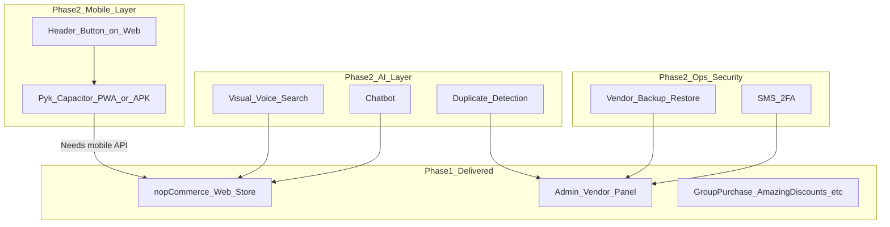
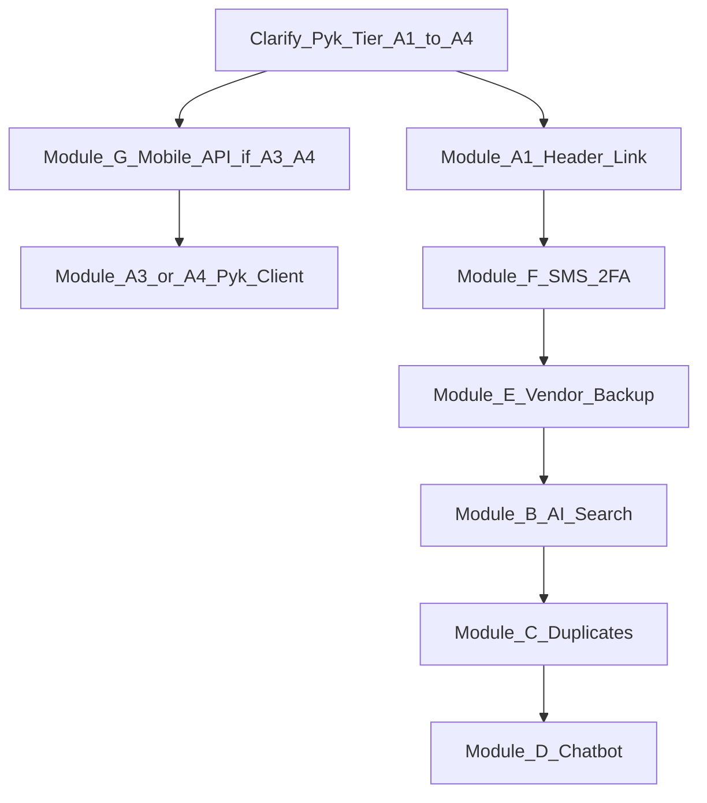

# Revised Phase 2 Plan (after harajbozorg APK analysis)

**Based on:** Static APK analysis — see [06-harajbozorg-apk-analysis.md](./06-harajbozorg-apk-analysis.md)  
**Supersedes:** High-level assumptions in the original Phase 2 guide where they conflict with APK evidence  
**Does not replace:** [05-phase2-modular-proposal.md](./05-phase2-modular-proposal.md) — use both together

---

## What changed after analyzing the APK

| Assumption before | Finding after APK analysis |
|-------------------|----------------------------|
| harajbozorg might show AI search/chat features | **Not present** — text search + QR scanner only |
| APK might be built from this repo | **No** — ForoshGostar FGMobile 6.1.1, separate product |
| APK might share custom Group Purchase APIs | **No** — uses `harajbozorg.com/api/v2` nop-shaped routes only |
| Pyk = simple external link | Pyk is likely **same class of app** as harajbozorg (Capacitor PWA/APK) |
| Client’s feature list is “in the reference app” | Only **mobile storefront + OTP + QR** overlap; AI/backup/MAC do not |

---

## Architecture target (what client actually wants)

---

## Revised module definitions

### Module A — Pyk mobile + web link (expanded)

**Original scope:** Header button only.  
**Revised scope after APK:** Clarify with client which tier they mean.

| Tier | Deliverable | Effort |
|------|-------------|--------|
| **A1** | Header/icon on web → opens Pyk URL | 1–2 days |
| **A2** | A1 + deep link / app scheme / smart banner (install PWA) | 3–5 days |
| **A3** | Full Pyk client: Ionic/Capacitor app like harajbozorg against **client’s** store API | 8–16 weeks |
| **A4** | License ForoshGostar FGMobile + configure for client domain + wire custom plugins | Variable (license cost + 2–6 weeks integration) |

**Quote:** [02-quote-pyk-header-link.md](./02-quote-pyk-header-link.md) covers **A1 only**. Do not quote A3 at A1 price.

**Client must decide:** Build custom Pyk (A3), buy ForoshGostar (A4), or link to existing Pyk URL (A1).

---

### Module B — Visual + voice AI search

**APK reference:** Standard `ion_searchbar` + `qr-code-scanner` — **no AI image/voice search**.

| Build on nopCommerce | Build on Pyk mobile (if A3/A4) |
|----------------------|--------------------------------|
| Storefront plugin: upload image, mic, results page | Same features in Ionic app via Capacitor camera + STT |
| New search API + vector/vision index | Mobile calls same API |

**Effort:** 3–6 weeks web; +2–4 weeks if mobile UI parity required.  
**Dependency:** AI API keys; Persian STT quality validation.

---

### Module C — AI duplicate product detection

**APK reference:** **None** — do not cite harajbozorg as precedent.

**Effort:** 4–8 weeks (unchanged).  
**Questionnaire:** [04-questionnaire-duplicate-detection-scope.md](./04-questionnaire-duplicate-detection-scope.md)

---

### Module D — AI chatbot

**APK reference:** **None**.

**Effort:** 2–5 weeks integrated RAG (unchanged).

---

### Module E — Vendor backup / restore

**APK reference:** **None** (no vendor panel in mobile app).

**Effort:** 3–5 weeks (unchanged).  
**Questionnaire:** [03-questionnaire-vendor-backup-scope.md](./03-questionnaire-vendor-backup-scope.md)

---

### Module F — SMS 2FA + access control

**APK reference:** **Partial** — mobile app has `mobile-verify-token` and OTP UI (customer phone verification), not admin SMS 2FA.

| Item | In APK | In your nopCommerce |
|------|--------|---------------------|
| Customer phone OTP | Yes (platform flow) | Custom if needed |
| Admin SMS 2FA | No | Build MFA plugin |
| Global admin IP allowlist | N/A | **Already built** |
| MAC restriction | No | **Not web-feasible** — [01-mac-address-admin-security-note.md](./01-mac-address-admin-security-note.md) |

**Effort:** 1.5–3 weeks (unchanged).

---

## New prerequisite: Mobile API gap

Before Pyk (A3/A4) can match harajbozorg, the backend needs a **documented REST layer**:

| API source | Status in your project |
|------------|------------------------|
| ForoshGostar `/api/v2` compatibility | **Not included** — separate commercial stack |
| nopCommerce Web API (1100+ methods) | **Stub only** — must purchase/install |
| Custom APIs (`/api/group-purchase`, etc.) | **Partial** — Group Purchase, Notifications, Amazing Discounts |

**Recommendation:** Add **Module G — Mobile API foundation** (if client wants harajbozorg parity):

- Install/configure official nopCommerce Web API **or** implement ForoshGostar-compatible facade
- Expose custom plugin endpoints to mobile
- JWT/Basic auth, CORS, staging environment

**Effort:** 2–4 weeks (Web API install + custom endpoint mapping) — before or parallel with A3.

---

## Revised rollout order

1. **Decision meeting:** Pyk tier (A1 vs A3/A4) — changes budget by an order of magnitude  
2. **Quick win:** A1 header link + show client existing admin IP setting  
3. **If mobile parity required:** Module G → then Pyk client  
4. **Security & vendor ops:** F → E  
5. **AI (not in reference APK):** B → C → D  

---

## Client conversation script (updated)

> We analyzed the harajbozorg APK in detail. It is a **ForoshGostar mobile app** (version 6.1.1) that connects to **harajbozorg.com** — not to the codebase we delivered. It is a useful **reference for mobile UX** (Persian RTL, cart, checkout, push, QR scan, phone OTP).
>
> It does **not** include the AI features you listed (visual/voice search, duplicate detection, chatbot) or vendor backup/restore. Those remain **new Phase 2 development** on your nopCommerce platform.
>
> For Pyk, please confirm:
> 1. Do you only need a **website button** linking to an existing Pyk URL? (small task)
> 2. Or do you need a **full mobile app like harajbozorg** for your store? (major task — requires mobile API + Capacitor client or ForoshGostar license)
>
> The marketplace we delivered is complete for Phase 1. Phase 2 modules are optional add-ons documented in the proposal package.

---

## Pricing summary (unchanged effort; clearer dependencies)

| Module | Effort | APK validates need? |
|--------|--------|---------------------|
| A1 Pyk link | 1–2 days | Yes — web → mobile entry point |
| A3 Custom Pyk app | 8–16 weeks | Yes — harajbozorg is the benchmark |
| G Mobile API | 2–4 weeks | Required for A3/A4 |
| B AI search | 3–6 weeks | **No** — not in APK |
| C Duplicate AI | 4–8 weeks | **No** |
| D Chatbot | 2–5 weeks | **No** |
| E Vendor backup | 3–5 weeks | **No** |
| F SMS 2FA | 1.5–3 weeks | Partial (OTP exists in APK for customers) |

---

## Immediate next steps

1. Send client [06-harajbozorg-apk-analysis.md](./06-harajbozorg-apk-analysis.md)  
2. Ask: **Pyk A1, A3, or A4?**  
3. If A3/A4: quote Module G + mobile client separately  
4. Keep AI modules (B–D) quoted independently — APK does not reduce their scope  
5. Use existing questionnaires for C and E before fixed pricing  
