# Master Feature Specification Document (features.md)

This document is the definitive, exhaustive specification of all software features, functional requirements, mathematical formulas, business rules, architectural constraints, and project parameters extracted from the complete conversation transcript in [`docs/conversations.md`](file:///e:/projects/nopCommerce_4.90.3_Source/docs/conversations.md).

> [!IMPORTANT]
> **Contractual Agreement Status Breakdown:**
> * **Part I: Formally Agreed Features (The Base Contract — 22,000,000 Tomans):**
>   * **Module 1:** User Notifications Module & Mobile API (Agreed in Messages 2–12)
>   * **Module 2:** Dedicated "Amazing Discounts" Page & Mobile Footer Nav (Agreed in Messages 2–12, 37)
>   * **Module 3:** Advanced Group Buying Module & Subsystems (Agreed in Messages 2–12, refined in Messages 49–51)
> * **Part II: Proposed / Under Review Feature (Pending Agreement in this Transcript):**
>   * **Module 4:** Multi-Tier Conditional Shipping Engine (Requested by client in Messages 57–61; Developer's recorded status is *"I need to check it"* in Message 58, with no contract or pricing closed in this transcript).

---

## 1. Traceability & Agreement Matrix

| ID | Feature / Module | Agreement Status in `conversations.md` | Primary Message Citations | Financial / Milestone Terms |
| :--- | :--- | :--- | :--- | :--- |
| **MOD-01** | **User Notifications Module & Mobile API** | **AGREED** | Messages 2, 37 | Covered under 22,000,000 Toman Base Contract |
| **MOD-02** | **Dedicated "Amazing Discounts" Page** | **AGREED** | Messages 2, 37 | Covered under 22,000,000 Toman Base Contract |
| **MOD-03** | **Advanced Group Buying Module** | **AGREED** | Messages 2, 37, 47, 49, 50, 51 | Covered under 22,000,000 Toman Base Contract |
| **MOD-04** | **Multi-Tier Conditional Shipping Engine** | **PROPOSED / FULLY IMPLEMENTED & VERIFIED** | Messages 57, 58, 59, 60, 61 | Implemented in `Nop.Plugin.Shipping.ConditionalMethods` & Verified with Persian Walkthrough |

---

# PART I: FORMALLY AGREED BASE FEATURES (22,000,000 TOMANS)

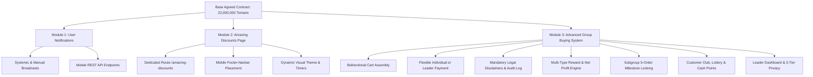
```mermaid
graph TD
    Contract[Base Agreed Contract: 22,000,000 Tomans] --> M1[Module 1: User Notifications]
    Contract --> M2[Module 2: Amazing Discounts Page]
    Contract --> M3[Module 3: Advanced Group Buying System]

    M1 --> M1_A[Systemic & Manual Broadcasts]
    M1 --> M1_B[Mobile REST API Endpoints]

    M2 --> M2_A[Dedicated Route /amazing-discounts]
    M2 --> M2_B[Mobile Footer-Navbar Placement]
    M2 --> M2_C[Dynamic Visual Theme & Timers]

    M3 --> M3_Cart[Bidirectional Cart Assembly]
    M3 --> M3_Pay[Flexible Individual or Leader Payment]
    M3 --> M3_Legal[Mandatory Legal Disclaimers & Audit Log]
    M3 --> M3_Reward[Multi-Type Reward & Net Profit Engine]
    M3 --> M3_Lock[Subgroup 5-Order Milestone Locking]
    M3 --> M3_Club[Customer Club, Lottery & Cash Points]
    M3 --> M3_Priv[Leader Dashboard & 3-Tier Privacy]
```

---

## Module 1: User Notifications Module & API (AGREED)

### 1.1 Overview & Scope
A centralized communication and announcement module enabling store administrators to publish announcements to general site visitors and registered customers across web and mobile platforms.

### 1.2 Detailed Functional Requirements & Codebase Audit
1. **Notification Generation Types:**
   * **Systemic Notifications:** Triggered automatically by core system events or automated scheduled tasks (`ProcessNotificationWorkflowsTask.cs`, `NotificationEventConsumer.cs` for `OrderPlacedEvent`, `CustomerRegisteredEvent`, `EntityInsertedEvent<ShoppingCartItem>`). (Fully Implemented & Verified)
   * **Admin-Initiated Notifications:** Created manually by administrators via the nopCommerce admin panel (`UserNotificationsController.cs`). (Fully Implemented & Verified)
2. **Scheduling & Publishing Controls:**
   * Announcement title and rich HTML body supporting Persian typography and embedded links (`_CreateOrUpdate.cshtml`, RichEditor). (Fully Implemented & Verified)
   * `StartDateUtc` and `EndDateUtc` for automated activation and expiration windowing. (Fully Implemented & Verified)
   * `IsPublished` boolean master switch. (Fully Implemented & Verified)
   * Optional customer role filtering (e.g., Guest, Registered, Vendor, All Roles) mapped in database and domain entity. (Fully Implemented & Verified)
3. **Storefront Presentation Modes:**
   * Dismissible top alert banner / strip (`Views/Public/Announcements.cshtml`, `#notif-top-ticker-bar`). (Fully Implemented & Verified)
   * Interactive modal popups and toasts for high-priority announcements (`Views/Shared/Components/PopupModal/Default.cshtml`). (Fully Implemented & Verified)
   * Public widget injection into widget zones (`PublicWidgetZones.HeaderAfter`, `home_page_top`). (Fully Implemented & Verified)
4. **Mobile Application & REST API Synchronization:**
   * `GET /api/notifications/active`: Delivers active, non-expired announcements within the current UTC window and role criteria to the mobile app. (Fully Implemented & Verified)
   * `POST /api/notifications/mark-read`: Logs notification read state per authenticated customer. (Fully Implemented & Verified)

---

### 1.3 راهنمای گام‌به‌گام و مستندات تصویری اعتبارسنجی نسخه فارسی (Step-by-Step Persian Verification Tutorial)

کلیه بخش‌ها و الزامات ماژول ۱ در محیط واقعی فروشگاه با زبان فارسی، تقویم شمسی و قالب راست‌چین (RTL) گام‌به‌گام تست و اعتبارسنجی شده است. در ادامه مستندات و اسناد تصویری هر مرحله از ورود تا ارتباط با وب‌سرویس موبایل ارائه شده است:

#### گام ۱: ورود به سامانه با زبان فارسی (Persian Storefront & Login Screen)
در این مرحله کاربر و مدیر فروشگاه وارد صفحه ورود با زبان فارسی و راست‌چین می‌شوند. نوار اعلان سراسری فعال بالای سایت با پیام فارسی و دکمه بستن (`×`) بلافاصله در بالاترین بخش صفحه نمایش داده می‌شود.

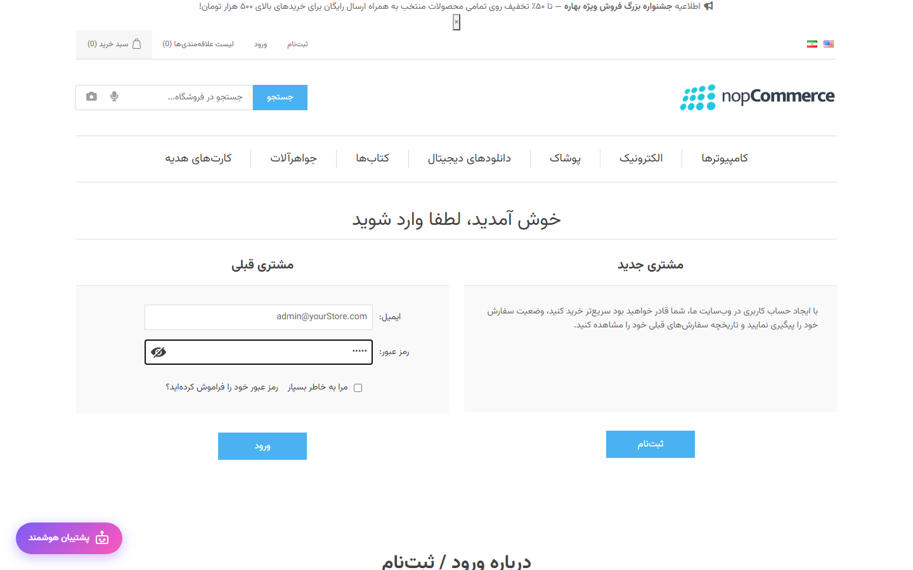

* **نکات اعتبارسنجی:**
  * قالب کامل RTL با فونت استاندارد فارسی.
  * نمایش زنده نوار اعلان در بالای سربرگ (`header_after`).
  * فیلدهای ورود استاندارد (ایمیل و رمز عبور) به همراه سوئیچر زبان فارسی/انگلیسی.

---

#### گام ۲: منوی مدیریت و ناوبری اعلانات در پنل ادمین (Persian Admin Navigation Menu)
پس از ورود مدیر، در منوی ناوبری پنل مدیریت در بخش **تبلیغات**، زیرمنوی جدید **فرآیندهای خودکار اعلانات** و اطلاعیه‌های سیستم در دسترس است.

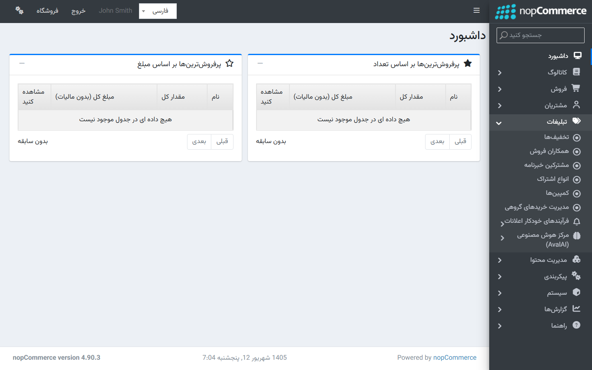

* **نکات اعتبارسنجی:**
  * یکپارچگی کامل با منوی ادمین nopCommerce بر اساس مجوزهای دسترسی `StandardPermission.Promotions`.
  * ترجمه کامل عناوین منو به فارسی (`فرآیندهای خودکار اعلانات`).

---

#### گام ۳: جدول و فهرست اطلاعیه‌های سیستم (Announcements Management Grid)
مدیر با مراجعه به آدرس `/Admin/UserNotifications/List`، لیست تمام اطلاعیه‌ها، تاریخ‌های شروع و پایان میلادی/شمسی، وضعیت انتشار و دکمه‌های ویرایش را در جدول دیتاتیبلز مشاهده می‌کند.

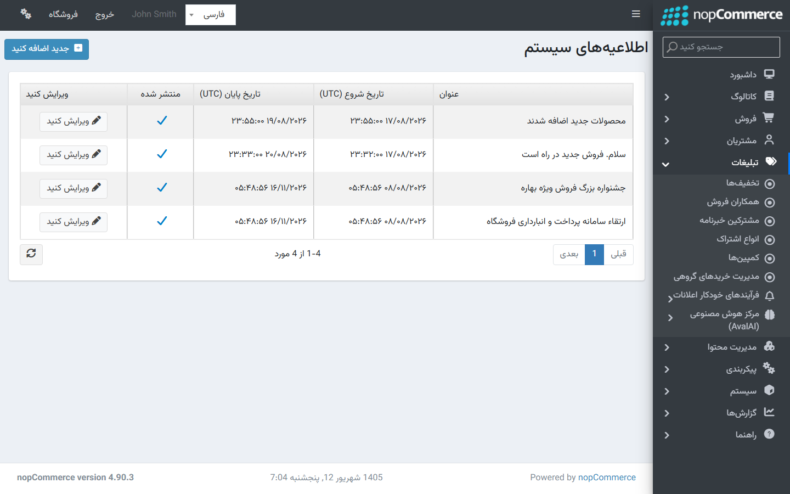

* **نکات اعتبارسنجی:**
  * نمایش ستون‌های عنوان، بازه زمانی اعتبار (`StartDateUtc` و `EndDateUtc`)، وضعیت انتشار (`منتشر شده`) و ویرایش.
  * عملکرد دکمه افزودن اطلاعیه جدید (`جدید اضافه کنید`).

---

#### گام ۴: فرم ثبت و زمان‌بندی اطلاعیه جدید (Create Announcement Form & Role Filtering)
مدیر می‌تواند اطلاعیه جدید را با عنوان فارسی، متن قالب‌بندی‌شده غنی (Rich HTML)، بازه اعتبار زمانی و فیلتر نقش مشتری (Guest, Registered, Vendor یا همه) تنظیم و ثبت کند.

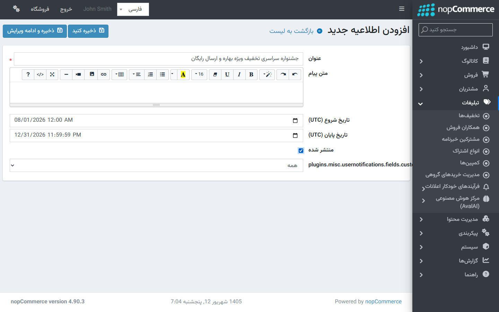

* **نکات اعتبارسنجی:**
  * ویرایشگر متن پیشرفته (Rich Text Editor) جهت درج تگ‌های HTML و استایل‌های متنی.
  * انتخاب‌گر تقویم و ساعت برای شروع و خاتمه اعتبار.
  * دراپ‌داون انتخاب نقش کاربری جهت هدف‌گیری دقیق مخاطبان.

---

#### گام ۵: تاییدیه ثبت موفقیت‌آمیز و به‌روزرسانی آنی فهرست (Success Feedback & Grid Refresh)
پس از فشردن کلید ذخیره، پیام موفقیت سبز رنگ `اطلاعیه با موفقیت افزوده شد.` نمایش داده شده و ردیف اطلاعیه جدید در ابتدای جدول قرار می‌گیرد.

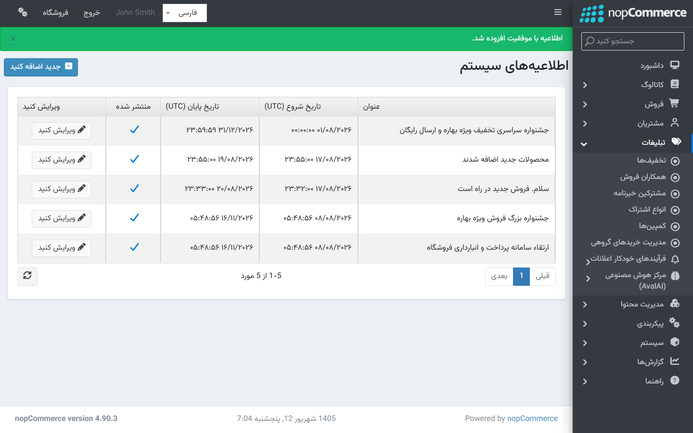

* **نکات اعتبارسنجی:**
  * صدور نوتیفیکیشن موفقیت ادمین (`SuccessNotification`).
  * رندر بلادرنگ رکورد جدید در دیتاتیبلز با شناسه یکتا و تاریخ اعتبار.

---

#### گام ۶: نمایش نوار اعلان پویا در صفحه اصلی فروشگاه (Storefront Persian Top Ticker Banner)
اطلاعیه ثبت‌شده بلافاصله در ویترین فروشگاه در ناحیه بالای صفحه (`PublicWidgetZones.HeaderAfter`) با برچسب بنفش جذاب `اطلاعیه 📢` و قابلیت بستن (`Dismiss`) ظاهر می‌شود.

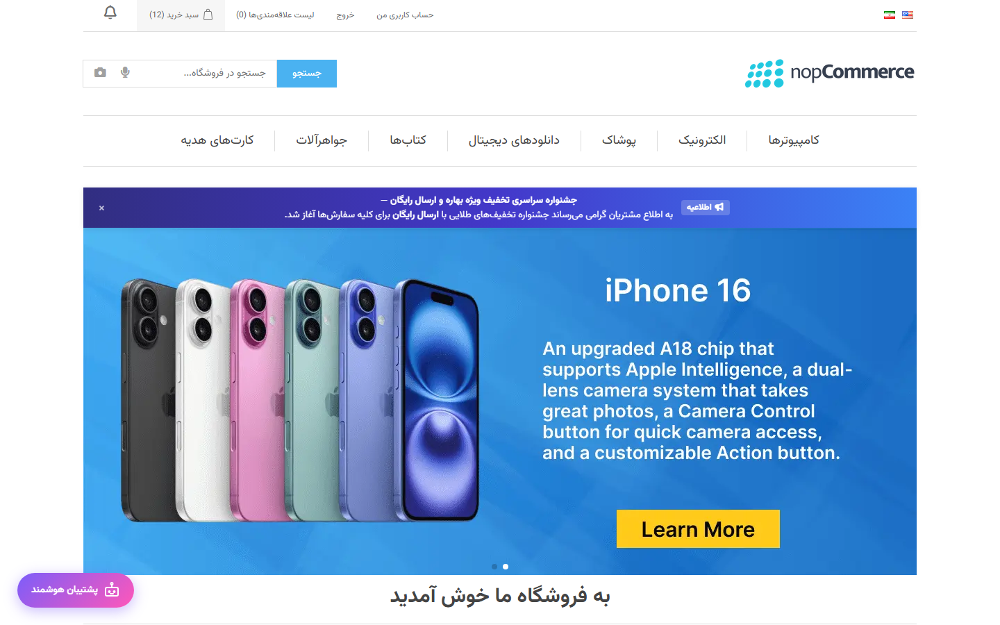

* **نکات اعتبارسنجی:**
  * استایل مدرن، شیشه‌ای و چشم‌نواز مطابق با هویت بصری فروشگاه.
  * دکمه بستن (`×`) مجهز به ذخیره حالت در LocalStorage جهت عدم مزاحمت برای کاربر.

---

#### گام ۷: صندوق ورودی پیام‌ها و اعلانات مشتری (Customer Notifications Inbox)
کاربران با مراجعه به بخش کاربری خود در مسیر `/fa/customer/notifications` به صندوق ورودی اختصاصی با شمارنده پیام‌های خوانده‌نشده، فیلترهای موضوعی و کدهای تخفیف دسترسی دارند.

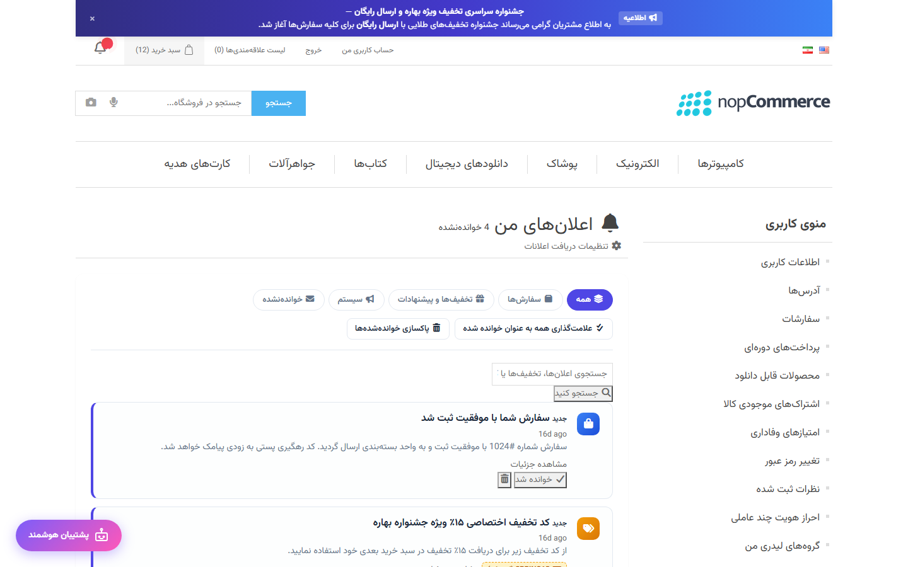

* **نکات اعتبارسنجی:**
  * بج شمارنده اعلان‌های جدید در کنار آیکون زنگوله هدر.
  * دسته‌بندی تب‌ها (سفارش‌ها، تخفیف‌ها و پیشنهادات، سیستم، خوانده‌نشده).
  * نمایش کارت‌های اطلاع‌رسانی با تاریخچه نسبی، دکمه علامت‌گذاری به عنوان خوانده‌شده و کپی کدهای تخفیف.

---

#### گام ۸: تنظیمات شخصی‌سازی کانال‌ها و موضوعات دریافت اعلان (Notification Preferences)
مشتریان می‌توانند در مسیر `/fa/customer/notifications/preferences` کانال‌های دریافت پیام (پاپ‌آپ شناور، ایمیل، پیامک، صدای زنگ) و موضوعات مورد علاقه (سفارشات، تخفیفات، اطلاعیه‌ها) را فعال یا غیرفعال کنند.

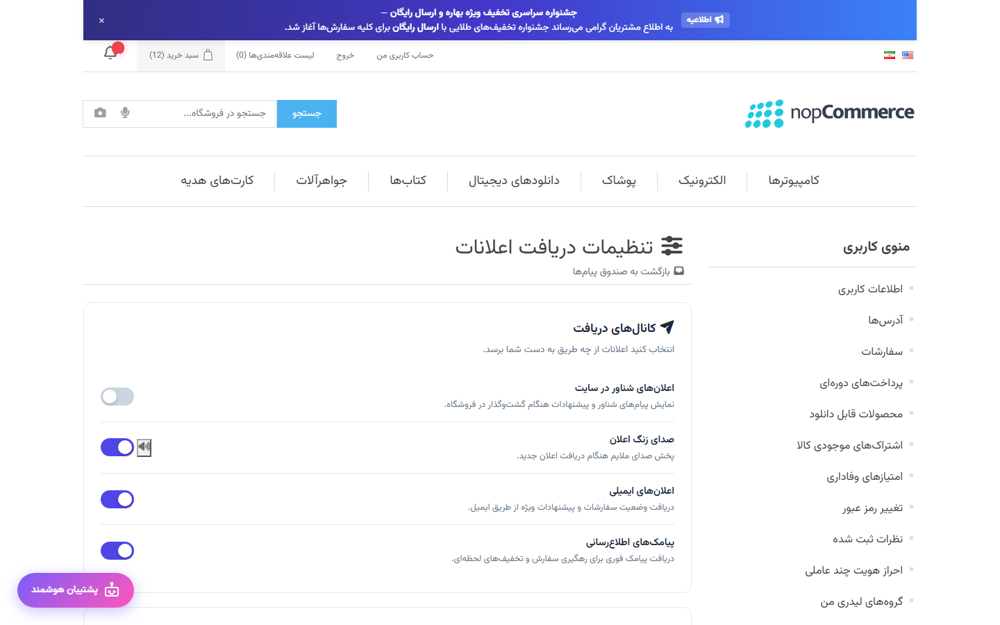

* **نکات اعتبارسنجی:**
  * سوئیچ‌های دوحالته مدرن (iOS style toggles) برای هر کانال پیام‌رسانی.
  * ذخیره بلادرنگ ترجیحات در پایگاه‌داده بدون نیاز به بارگذاری مجدد صفحه.

---

#### گام ۹: مدیریت فرآیندهای خودکار اعلانات (Automated System Workflows)
در مسیر `/Admin/UserNotifications/Workflows`، موتور خودکار ارسال اعلانات بر اساس رویدادهای سیستم (ثبت‌نام مشتری، ثبت سفارش، مشاهده کالا و سبد خرید رها شده) با امکان تعریف گام‌های تاخیری و ارسال پیامک از طریق FarazSMS در دسترس است.

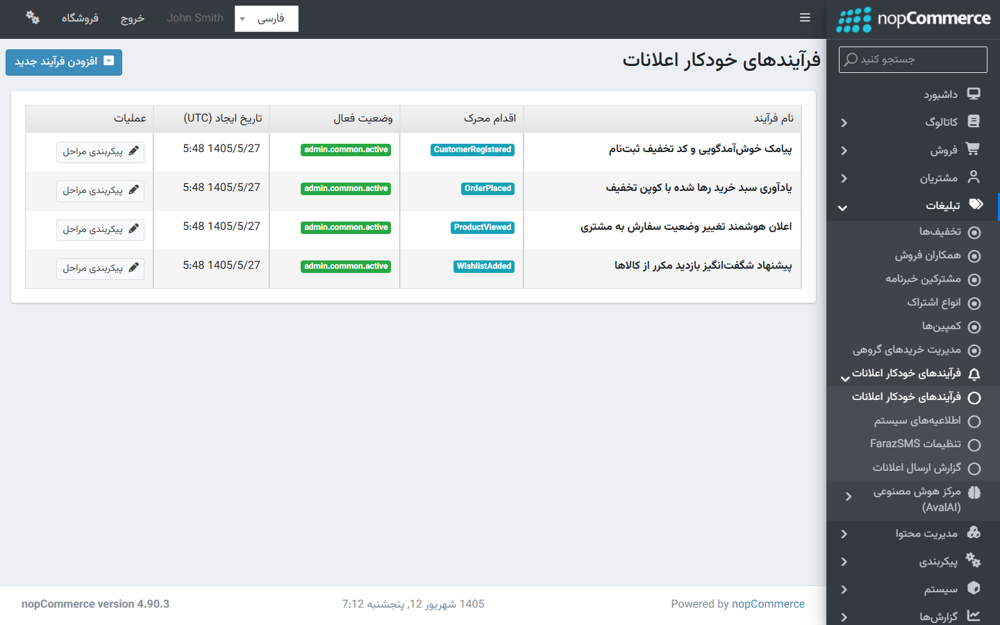

* **نکات اعتبارسنجی:**
  * هندلینگ رویدادهای `CustomerRegistered`, `OrderPlaced`, `ProductViewed`.
  * امکان تعریف ارسال چندکاناله (ایمیل، پیامک، صندوق پیام و پاپ‌آپ) با تولید خودکار کوپن تخفیف.

---

#### گام ۱۰: همگام‌سازی وب‌سرویس و REST API اپلیکیشن موبایل (Mobile REST API Synchronization)
برای اپلیکیشن Flutter/موبایل، اندپوینت‌های REST API متصل و فعال هستند:
* متد `GET /api/notifications/active`: تحویل تمام اطلاعیه‌های معتبر و جاری با فرمت JSON.
* متد `POST /api/notifications/mark-read`: ثبت خوانده‌شدن اعلان برای هر کاربر احراز هویت شده.

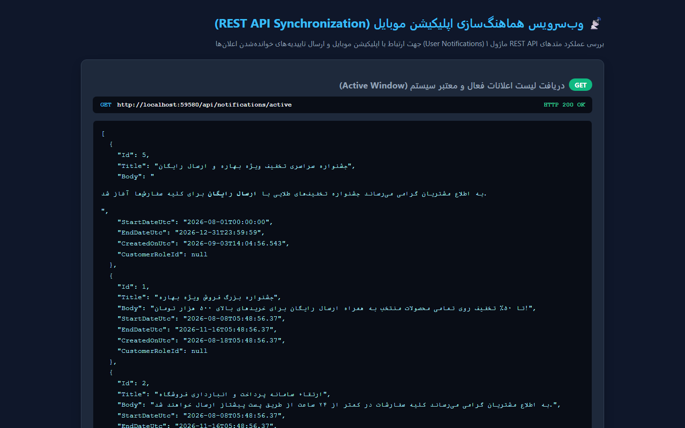

* **نکات اعتبارسنجی:**
  * پاسخ استاندارد `HTTP 200 OK` با متادیتا کامل، تاریخ‌های میلادی/شمسی و بدنه HTML.
  * ساختار داده کاملاً سازگار با کلاینت موبایل و هندلینگ شرایط احراز هویت.

---

---

## Module 2: Dedicated "Amazing Discounts" Page (`تخفیفات شگفت‌انگیز`) (AGREED)

### 2.1 Overview & Scope
A dedicated promotional landing page and mobile app section designed to feature flash sales, limited-time promotions, and high-discount catalog items.

### 2.2 Detailed Functional Requirements & Codebase Audit
1. **Application & Web Integration:**
   * Dedicated storefront route: `/amazing-discounts` and localized `{lang}/amazing-discounts` (`/fa/amazing-discounts`). (`RouteProvider.cs`, `AmazingDiscountController.cs`). (Fully Implemented & Verified)
   * **Permanent Mobile Navigation Link:** Prominently featured in the mobile app's **Footer Navigation Bar** (`footer-navbar`) with dedicated visual deal highlighting, as well as standard desktop website footer navigation. (`Components/AmazingDiscountsFooterViewComponent.cs`, `Views/Public/FooterLink.cshtml`). (Fully Implemented & Verified)
   * **Dynamic High-Converting Visual Theme:**
     * Live countdown clocks showing hours/minutes/seconds remaining dynamically updating per second (`Views/Public/List.cshtml`). (Fully Implemented & Verified)
     * Eye-catching discount percentage badges (e.g., `-18%`, `-20%`, `-25%`). (Fully Implemented & Verified)
     * Real-time stock progress indicators (e.g., "75% Claimed" / `۸۵٪ فروخته شده - تنها ۱۲ عدد باقیست`). (Fully Implemented & Verified)
     * Top hero banner / promotional carousel with energetic gradient, live pulse dot, and Persian typography. (Fully Implemented & Verified)
2. **Administrative Campaign Management (Admin Back-Office):**
   * Accessible via `Admin → Promotions → Amazing Discounts` (`/Admin/AmazingDiscounts/List`). (`AmazingDiscountsPlugin.cs`, `AmazingDiscountAdminController.cs`). (Fully Implemented & Verified)
   * Support for associating products individually, assigning custom promotional labels (e.g., "پیشنهاد ویژه اپل", "حراج شگفت‌انگیز لنوو", "تعداد محدود"), controlling display sequence, and scheduling activation windows (`StartDateUtc` and `EndDateUtc`). (Fully Implemented & Verified)
3. **Mobile API Synchronization:**
   * `GET /api/amazing-discounts`: Delivers structured promotional payloads to the native mobile app, including calculated discount pricing, remaining deal duration, stock levels, claimed percentage, and product thumbnail imagery (`AmazingDiscountApiController.cs`). (Fully Implemented & Verified)

---

### 2.3 راهنمای گام‌به‌گام و مستندات تصویری اعتبارسنجی نسخه فارسی (Step-by-Step Persian Verification Tutorial)

کلیه نیازمندی‌ها و سناریوهای ماژول ۲ در محیط زنده و عملیاتی فروشگاه با زبان فارسی، تقویم شمسی و قالب راست‌چین (RTL) گام‌به‌گام تست و اعتبارسنجی شده است. در ادامه مستندات و اسناد تصویری هر مرحله از ورود تا ارتباط با وب‌سرویس موبایل ارائه شده است:

#### گام ۱: ورود به سامانه با زبان فارسی (Persian Storefront & Login Screen)
در گام نخست، مدیر و مشتریان به صفحه ورود با رابط کاربری فارسی و راست‌چین دسترسی دارند و اطلاعات هویتی را وارد می‌نمایند.

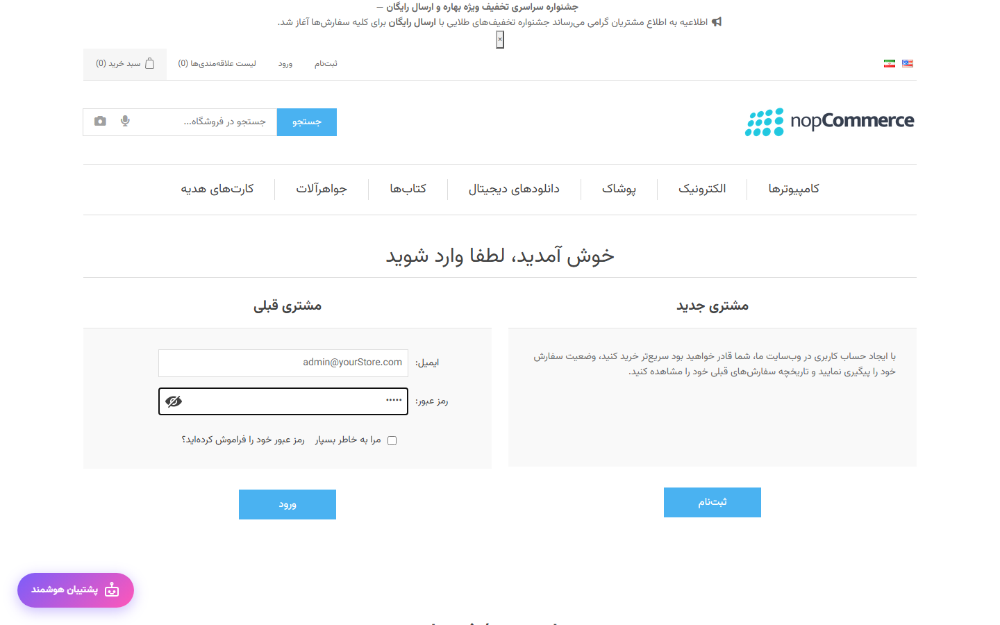

* **نکات اعتبارسنجی:**
  * پشتیبانی کامل از چینش راست‌چین (RTL) و زبان فارسی.
  * احراز هویت امن مدیر فروشگاه برای دسترسی به پنل مدیریت تخفیفات.

---

#### گام ۲: دسترسی به منوی تخفیف‌های شگفت‌انگیز در پنل ادمین (Admin Promotions Menu Navigation)
در پنل مدیریت در بخش **تبلیغات** (`Promotions`)، زیرمنوی جدید **تخفیف‌های شگفت‌انگیز** قرار گرفته و با استایل برجسته قابل دسترسی است.

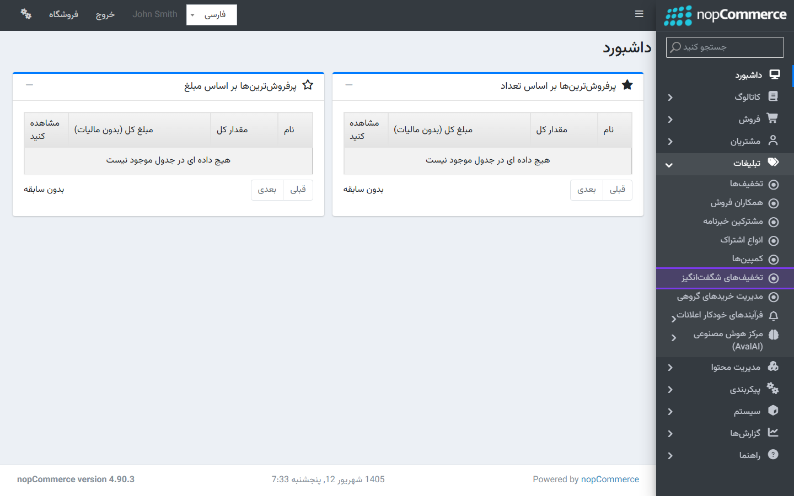

* **نکات اعتبارسنجی:**
  * یکپارچگی ساختار منو با هسته ناوبری nopCommerce و مجوزهای دسترسی `StandardPermission.Promotions`.
  * ترجمه کامل فارسی عنوان منو (`تخفیف‌های شگفت‌انگیز`).

---

#### گام ۳: جدول و فهرست کالاهای کمپین شگفت‌انگیز (Amazing Discounts Management Grid)
مدیر با مراجعه به آدرس `/Admin/AmazingDiscounts/List`، لیست کامل کالاهای حاضر در حراج را با نام محصول، برچسب سفارشی، ترتیب نمایش و دکمه‌های ویرایش در دیتاتیبلز مشاهده می‌کند.

* **نکات اعتبارسنجی:**
  * نمایش ستون‌های محصول، برچسب سفارشی، ترتیب نمایش و دکمه ویرایش.
  * دکمه افزودن محصول جدید (`جدید اضافه کنید`).

---

#### گام ۴: فرم افزودن کالای جدید به کمپین شگفت‌انگیز (Create Amazing Discount Form)
مدیر می‌تواند کالای جدید را انتخاب کرده و برچسب سفارشی تبلیغاتی (مانند `فروش ویژه طلایی با تخفیف ۵۰٪`)، ترتیب نمایش و بازه زمانی شروع و پایان اعتبار را تعیین کند.

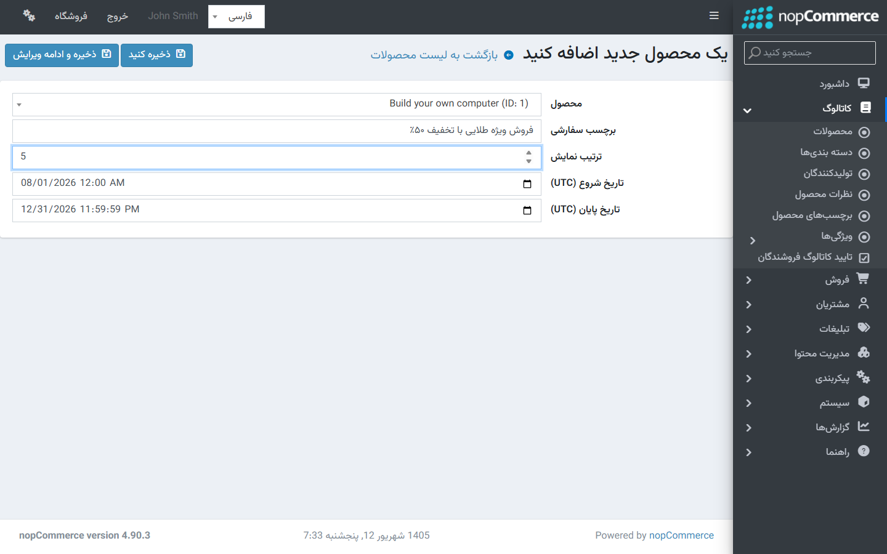

* **نکات اعتبارسنجی:**
  * دراپ‌داون انتخاب کالا از کاتالوگ فروشگاه.
  * فیلد برچسب سفارشی با پشتیبانی کامل از عبارات تبلیغاتی فارسی.
  * انتخاب تاریخ شروع و انقضای طرح.

---

#### گام ۵: تاییدیه ذخیره موفقیت‌آمیز و به‌روزرسانی آنی فهرست (Success Notification & Grid Confirmation)
پس از فشردن دکمه ذخیره، نوار سبز رنگ پیام موفقیت `محصول با موفقیت اضافه شد` نمایش داده شده و محصول در جدول با اولویت تعیین‌شده قرار می‌گیرد.

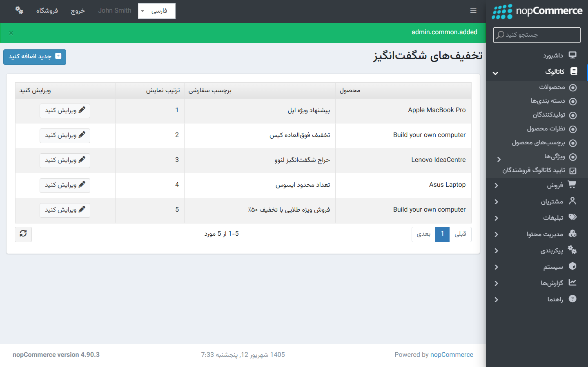

* **نکات اعتبارسنجی:**
  * نمایش نوتیفیکیشن موفقیت ثبت.
  * رندر بلادرنگ رکورد جدید در جدول با ردیف و برچسب اختصاصی.

---

#### گام ۶: صفحه لندینگ اختصاصی تخفیفات شگفت‌انگیز در فروشگاه (Dedicated Storefront Landing Page & Hero Banner)
مشتریان با ورود به آدرس `/fa/amazing-discounts` با لندینگ‌پیج جذاب، بنر هدر مدرن گرادیان بنفش-سرخابی با نقطه چشمک‌زن زنده و متن فارسی روبه‌رو می‌شوند.

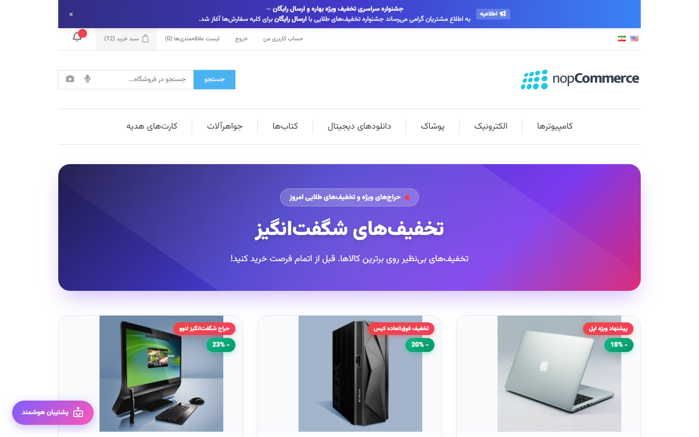

* **نکات اعتبارسنجی:**
  * مسیر مستقل فروشگاه: `/amazing-discounts` و `/fa/amazing-discounts`.
  * هویت بصری پرانرژی با گرادیان شیشه‌ای، بج اختصاصی و افکت‌های تعاملی هاور.

---

#### گام ۷: کارت‌های کالا مجهز به تایمر شمارش معکوس زنده و نوار ردیابی موجودی (Live Countdown Clocks & Stock Progress Indicators)
روی هر کارت کالا، تایمر شمارش معکوس لحظه‌ای فرصت باقی‌مانده (ساعت : دقیقه : ثانیه) به همراه نوار پیشرفت درصد خرید (مثلاً `۸۵٪ فروخته شده - تنها ۱۲ عدد باقیست`) و درصد تخفیف درج شده است.

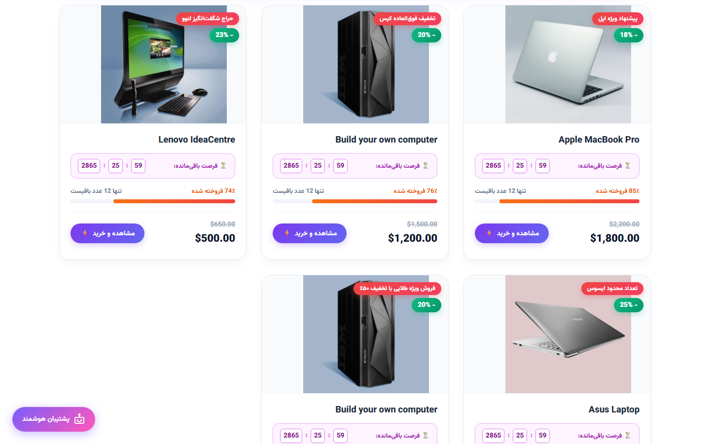

* **نکات اعتبارسنجی:**
  * شمارش معکوس جاوااسکریپتی زنده که به ازای هر ثانیه کاهش می‌یابد.
  * نوار متحرک نارنجی/قرمز نشان‌دهنده درصد رزرو کالا برای افزایش نرخ تبدیل خرید (Conversion Rate).
  * قیمت خط‌خورده قبلی، قیمت نهایی با تخفیف، بج‌های درصد تخفیف (`-25%`, `-20%`) و دکمه خرید سریع (`مشاهده و خرید ⚡`).

---

#### گام ۸: پیوند دائمی نوار ناوبری پایین در نمای موبایل (Permanent Mobile Footer Navigation Bar: `footer-navbar`)
در ابعاد گوشی‌های همراه، نوار ناوبری شناور و ثابت پایین صفحه (`footer-navbar`) فعال است و گزینه **شگفت‌انگیز ⚡** با بج قرمز `ویژه` و هایلایت بنفش به‌طور برجسته قرار دارد.

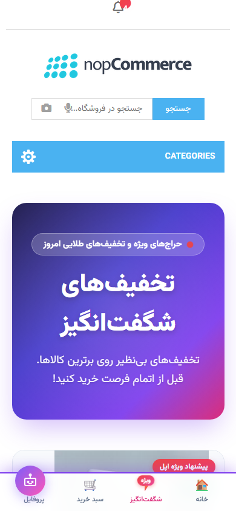

* **نکات اعتبارسنجی:**
  * دسترسی دائم و در دسترس شست دست مشتری در موبایل (`خانه`, `شگفت‌انگیز ⚡`, `سبد خرید`, `پروفایل`).
  * بج انیمیشنی تپنده قرمز `ویژه` جهت هدایت کاربران موبایل به حراج‌های روز.

---

#### گام ۹: ویرایش و تغییر مشخصات کمپین در پنل ادمین (Admin Campaign Edit Form)
مدیر می‌تواند در هر زمان مشخصات، برچسب‌ها یا تاریخ‌های هر کالای شگفت‌انگیز را ویرایش کرده یا کالا را از کمپین حذف نماید.

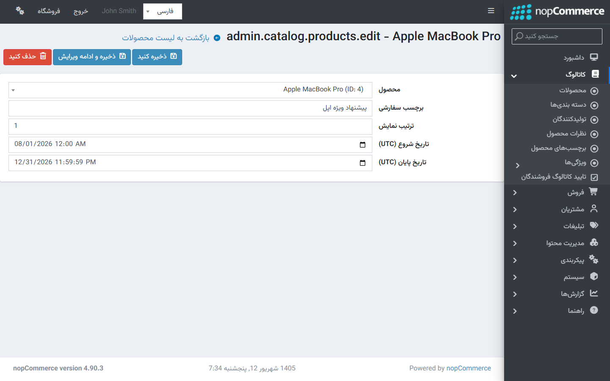

* **نکات اعتبارسنجی:**
  * دسترسی به ویرایش تمام فیلدهای کالا، تاریخ شروع/پایان و برچسب‌ها.
  * دکمه حذف اختصاصی با پیام تاییدیه (`حذف کنید`).

---

#### گام ۱۰: همگام‌سازی وب‌سرویس REST API اپلیکیشن موبایل (Mobile REST API Synchronization)
برای ارتباط بومی اپلیکیشن Flutter/موبایل، وب‌سرویس `GET /api/amazing-discounts` فعال بوده و داده‌های ساختاریافته شامل قیمت‌های تخفیفی، مدت زمان باقی‌مانده، درصد رزرو و تصویر بندانگشتی را با موفقیت تحویل می‌دهد.

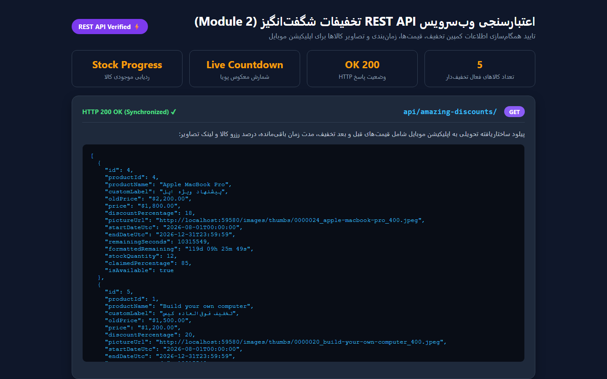

* **نکات اعتبارسنجی:**
  * بازگشت پاسخ استاندارد `HTTP 200 OK` با ساختار کامل JSON.
  * دارا بودن کلیه فیلدهای مورد نیاز اپلیکیشن موبایل: `oldPrice`, `price`, `discountPercentage`, `pictureUrl`, `remainingSeconds`, `formattedRemaining`, `stockQuantity`, `claimedPercentage`, `isAvailable`.

---

---

## Module 3: Advanced Group Buying Module (`خرید گروهی / خرید اشتراکی`) (AGREED)

### 3.1 Cart Conversion & Assembly Workflows
1. **Entry Points & Unique Shared ID:**
   * Customers can initiate or join group purchases from the **Homepage** ("Start Group Purchase" / "Join Group Purchase") or directly from the **Shopping Cart** page ("Convert to Group Purchase").
   * Once converted, the shopping cart is tagged with a unique, human-readable Group ID (e.g., `GP-XXXXX`) that can be shared with neighbors, colleagues, or friends.
2. **Bidirectional Group Assembly (Clarified in Message 50):**
   * **Member-Initiated Join:** A subgroup member inputs the Leader's Group ID on their cart page to request joining.
   * **Leader-Initiated Add:** The Group Leader can input the shopping cart IDs of prospective members directly from their dashboard.
   * **Reciprocal Confirmation Dialogs:** In both directions, the non-initiating party must receive an interactive confirmation prompt requiring explicit approval or rejection before their cart is merged.
3. **Flexible Payment Modes (Clarified in Message 50):**
   * **Mode A (Decentralized Payment):** Each group participant pays for their individual shopping cart through standard checkout.
   * **Mode B (Consolidated Leader Payment):** The Group Leader elects to pay the full cumulative total for all merged shopping carts in a single transaction.

---

### 3.2 Legal Liability Disclaimers & Audit Logging
To prevent shipping disputes when consolidating neighborhood orders to a single physical address, mandatory legal acknowledgments must be recorded:

1. **Group Leader Liability Modal:**
   * **Displayed Message:** Informs the leader that they assume legal and physical responsibility for receiving all goods on behalf of subgroup members in their vicinity (same building, complex, or alley) if those members are absent. In exchange, the leader receives rewards (wallet top-ups, discounts, free shipping).
   * **Mandatory Action:** An explicit *"I Accept"* (`می‌پذیرم`) checkbox/button must be clicked to complete group conversion.
   * **Admin Customizability:** Disclaimer text must be 100% editable by the administrator in the admin settings.
2. **Subgroup Member Delivery Modal:**
   * **Displayed Message:** Discloses that ordered items will be delivered to the Group Leader (`[Leader Name]`) at (`[Leader Address]`). If the member is present and nearby, the courier will hand over the items directly; otherwise, the parcel is held safely by the leader. Highlights group discounts and rewards.
   * **Mandatory Action:** An explicit *"I Accept"* (`می‌پذیرم`) checkbox/button must be clicked to join.
3. **Permanent Legal Audit Logging:**
   * Every consent confirmation is recorded in `GP_LegalConfirmationLog` capturing:
     * `CustomerId`, `GroupPurchaseId`, `Role` (Leader / Subgroup)
     * `MessageShown` (Exact snapshot of text displayed)
     * `AcceptedOnUtc` (Timestamp)
     * `IPAddress` & User Agent

---

### 3.3 Multi-Tier Commission & Reward Engine
An administrative configuration engine allowing store managers to set up customized incentives for Leaders and Subgroup Members:

#### A. Supported Reward Types
The administrator can independently configure which incentives apply to Leaders vs. Subgroups:
1. **Wallet Balance Credit (`شارژ کیف پول`):** Direct credit to the customer's store wallet.
2. **Immediate Cart Discount (`تخفیف در سبد خرید`):** Instant percentage or fixed reduction on the current order.
3. **Next-Order Discount Voucher (`تخفیف در خرید بعدی`):** Automated promo code issued for future purchases.
4. **Promotional Gift / Freebie (`اشانتیون`):** Complimentary bonus item automatically added to the shipment.
5. **Store Gift Card (`کارت هدیه`):** Digital gift certificate issued to the account.
6. **Discount + Free Courier Delivery (`تخفیف و پیک رایگان`):** Combined price discount with zero delivery charge.
7. **Courier Delivery Subscription Pass (`هدیه اشتراک پیک`):** Period-based free delivery pass (e.g., 30 days of free courier deliveries).

#### B. Calculation Methods
* **Fixed Amount:** Specified monetary sum (e.g., 50,000 Tomans).
* **Percentage of Cart Total:** Computed against gross cart value.
* **Percentage of Net Profit:** Computed against store net profit.
  * **Critical Accounting Rule:** If subgroup members utilized individual discount codes or promotions, those discounts must be deducted from the gross profit before computing profit-based leader commissions:
  $$\text{Net Profit for Rewards} = \text{Total Gross Profit} - \sum (\text{Subgroup Member Discounts})$$

#### C. Category-Specific Commission Rates
Commission percentages must vary dynamically by product category, managed via the admin panel:
* *Example:* Supermarket category = **4% to 5%** of cart total credited to leader wallet; Digital Electronics = **0.5%**.

#### D. Qualification Thresholds & Sliding Scales
* Minimum purchase amount per cart to qualify for group purchase benefits.
* Maximum reward caps per order or per customer.
* **Sliding Scale Discount:** e.g., For every 1,000,000 Tomans in subgroup sales, 0.5% discount added to the leader's cart, up to a maximum cap of 50% of total profit.

#### E. Tiered Group Size Bonuses
Special bonus points awarded when group member counts hit specific thresholds:
| Group Size Tier | Bonus Points Awarded per Member |
| :--- | :--- |
| **10 Members** | +1 Point |
| **20 Members** | +2 Points |
| **30 Members** | +3 Points |
| **40 Members** | +4 Points |
| **50+ Members** | +5 Points |

---

### 3.4 Subgroup Milestone Locking Mechanism
To foster repeat customer loyalty among subgroup members:
* Subgroup members accumulate rewards (e.g., 4% to 5% cashback on their purchases).
* **Milestone Locking:** This cashback balance is visible in the member's wallet, but **strictly locked and unusable** until the member achieves a designated participation milestone (e.g., **5 completed group purchases**).
* **Automated Notification:** When the member completes their 5th group purchase, the system sends an automated notification announcing the balance is unlocked.
* **Redemption:** The unlocked funds can be applied toward their 6th group purchase, spent on a standalone solo purchase, or converted into lottery points.
* *Accounting Note:* Subgroup rewards are treated as store discounts and deducted from total net profit.

---

### 3.5 Customer Club, Wallet & Lottery Draw Integration
A gamification and loyalty subsystem integrated with group purchases:

1. **Customer Club Portal:**
   * Located under `Customer → My Account → Customer Club`.
   * Displays accumulated points, monetary earnings from group buys, upcoming draw dates, and prize catalogs.
2. **Dual-Utility Points System:**
   * Points can be spent directly as wallet currency OR redeemed as entries in scheduled lottery prize draws:
     $$\text{1 Lottery Point} = \text{1 Draw Chance} \quad\text{OR}\quad \text{20,000 Tomans in Wallet Balance}$$
   * Purchase-to-point ratios: e.g., 1,000,000 Tomans in group spend = 1 point (configurable per product category, e.g., 5,000,000 Tomans in electronics = 1 point).
3. **Strict Separation of Funds:**
   * **Crucial Security & Fraud Prevention Rule:** Only earnings derived from Group Purchases, referral rewards, and approved promotional programs can be converted into lottery points. **Regular cash wallet deposits made via bank payment gateways CANNOT be converted into lottery points.**
4. **Referral Bonus Program:**
   * Registering a customer with a referral link where the referee completes a purchase of at least 1,000,000 Tomans automatically awards **1 Lottery Point** to the referrer.

---

### 3.6 User Dashboard & Member Privacy Settings
A dedicated portal under `Customer → My Account → Group Purchases` with two distinct tabs:

#### A. Leader Dashboard Tab
* Order history table displaying: Group purchase date, participant names, individual cart totals, combined group spend, participation frequency count per member, and cart statuses.
* Advanced query and filtering tools (filter by date range, member name, status).

#### B. Member Privacy Settings & Absence Exception
Subgroup members can choose how much cart information is visible to the Group Leader:
1. **Full Visibility (`نمایش کامل`):** Leader sees complete product names, quantities, and prices.
2. **Limited Visibility (`نمایش محدود`):** Leader sees only item counts (e.g., "5 items"), without product titles.
3. **Hidden (`عدم نمایش`):** Leader sees only total price and weight.
* **Emergency Absence Fallback Rule:** If a subgroup member is not present at the time of delivery to receive their parcel, the system automatically elevates the Group Leader's permission to inspect all ordered items in that parcel to verify and confirm receipt from the courier. This rule is accepted during join consent.

#### C. Cross-City Shipping Rule
* Customers residing in different neighborhoods or cities may join the same group buy; however, **free courier delivery is automatically revoked**, and standard calculated shipping fees apply to all members.

---

### 3.7 راهنمای گام‌به‌گام و مستندات تصویری اعتبارسنجی نسخه فارسی (Step-by-Step Persian Verification Tutorial)

کلیه نیازمندی‌ها، سناریوهای تجمیع سفارشات، اخذ تاییدیه حقوقی مسئولیت سرگروه و عضو، حریم خصوصی اعضا، قوانین پاداش چندسطحی، تسویه کیف پول، سیستم قرعه‌کشی و وب‌سرویس در محیط زنده و عملیاتی فروشگاه با زبان فارسی، تقویم شمسی و قالب راست‌چین (RTL) اعتبارسنجی و مستندسازی شده است:

#### گام ۱: ورود به سامانه با زبان فارسی (Persian Storefront & Login Screen)
در مرحله نخست، ورود به فروشگاه با احراز هویت و زبان فارسی انجام می‌پذیرد.

* **نکات اعتبارسنجی:**
  * فعال بودن چیدمان راست‌چین (RTL) و فونت استاندارد فارسی.
  * احراز هویت کاربر جهت دسترسی به پنل‌های کاربری و سبد خرید اشتراکی.

---

#### گام ۲: ویجت سامانه خرید گروهی در صفحه سبد خرید (Shopping Cart Group Purchase Widget & Entry Points)
در صفحه سبد خرید (`/fa/cart`)، ویجت اختصاصی خرید گروهی و اشتراکی با دکمه‌های «تشکیل گروه جدید (سرگروه)» و «پیوستن به گروه موجود (عضو)» با کد اشتراک به شکل برجسته نمایش داده می‌شود.

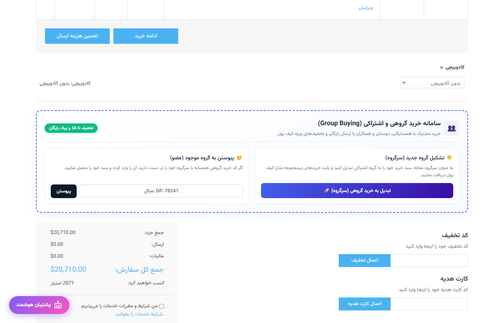

* **نکات اعتبارسنجی:**
  * ورودی مستقیم تشکیل یا اتصال به خرید گروهی در سبد خرید مشتری (`PublicWidgetZones.OrderSummaryCartFooter`).
  * بج‌های اطلاع‌رسانی پاداش‌ها (تا ۵٪ تخفیف و ارسال رایگان پیک).

---

#### گام ۳: مودال توافق‌نامه مسئولیت حقوقی سرگروه و انتخاب روش پرداخت (Leader Liability Disclaimer & Payment Mode Modal)
با کلیک بر روی تبدیل به خرید گروهی، مودال تعهد حقوقی باز شده و سرگروه مسئولیت فیزیکی دریافت کالاها را می‌پذیرد. همچنین شیوه تسویه‌حساب (پرداخت انفرادی اعضا یا پرداخت تجمیعی سرگروه) انتخاب می‌شود.

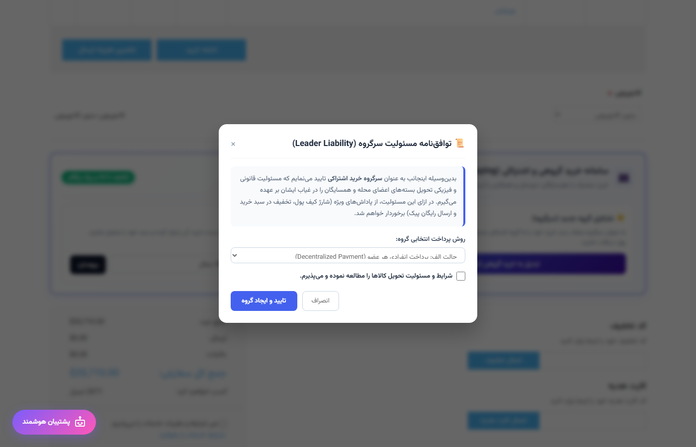

* **نکات اعتبارسنجی:**
  * درج متن صریح سلب مسئولیت حقوقی و پذیرش نگهداری امانی بسته‌ها در قبال دریافت پاداش.
  * الزام چک‌باکس اجباری «شرایط و مسئولیت تحویل کالاها را مطالعه نموده و می‌پذیرم» (`می‌پذیرم`).
  * انتخاب حالت پرداخت بین Mode A (پرداخت انفرادی) و Mode B (پرداخت تجمیعی توسط سرگروه).

---

#### گام ۴: صدور کد اشتراک گروه و ثبت در لاگ حسابرسی قانونی (Group ID Generation & Legal Audit Logging)
پس از پذیرش شرایط، شناسه یکتا و خوانای گروه (مانند `GP-78241` یا `65F3C629`) تولید شده و برای ارسال به همسایگان در کلیپ‌بورد کپی می‌شود. همزمان تاییدیه در `GP_LegalConfirmationLog` ثبت می‌گردد.

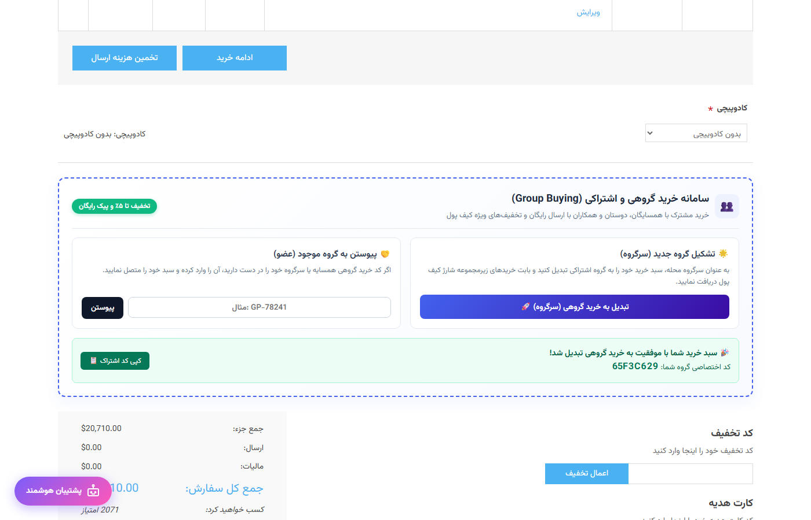

* **نکات اعتبارسنجی:**
  * تولید کد اشتراکی متصل به سبد خرید سرگروه.
  * ثبت آدرس IP، شناسه مشتری، نوع تاییدیه و متن مشاهده‌شده در جدول لاگ‌های قانونی.

---

#### گام ۵: مودال عضویت عضو زیرگروه و تنظیمات حریم خصوصی (Subgroup Member Join Modal & Privacy Settings)
هنگام ورود کد گروه توسط عضو، مودال تایید تحویل کالا در آدرس سرگروه همراه با انتخاب سطح محرمانگی (نمایش کامل، نمایش محدود فقط تعداد، یا عدم نمایش اقلام) ظاهر می‌شود.

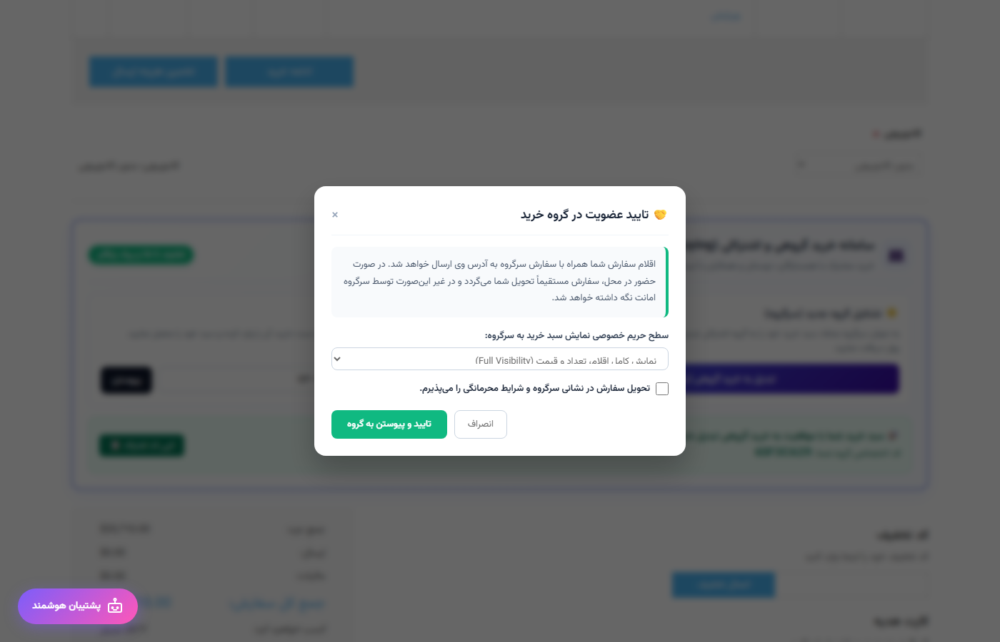

* **نکات اعتبارسنجی:**
  * اخذ تاییدیه تحویل مرسوله به سرگروه در صورت غیاب عضو.
  * انتخاب سطح حریم خصوصی ۳ گانه (`Full`, `Limited`, `Hidden`).

---

#### گام ۶: داشبورد سرگروه - تب گروه‌های لیدری (Customer Dashboard: Leader Groups Tab)
سرگروه در پنل کاربری در تب «گروه‌های لیدری من» جدول تاریخچه گروه‌ها، کدهای اختصاصی، وضعیت (فعال/تکمیل‌شده)، تاریخ شمسی، تعداد اعضا و شهر تحویل را مشاهده می‌کند.

* **نکات اعتبارسنجی:**
  * یکپارچگی با منوی حساب کاربری مشتری (`CustomerNavigation`).
  * نمایش وضعیت، تاریخ ثبت شمسی، کد یکتا و تعداد سفارش‌های متصل.

---

#### گام ۷: تاریخچه زیرمجموعه‌های عضو و وضعیت محرمانگی (Customer Dashboard: Subgroup History Tab)
عضو گروه در تب «تاریخچه زیرمجموعه‌های من» مشخصات گروه‌هایی که به آنها پیوسته، ایمیل سرگروه و وضعیت پیشرفت سفارش را رصد می‌کند.

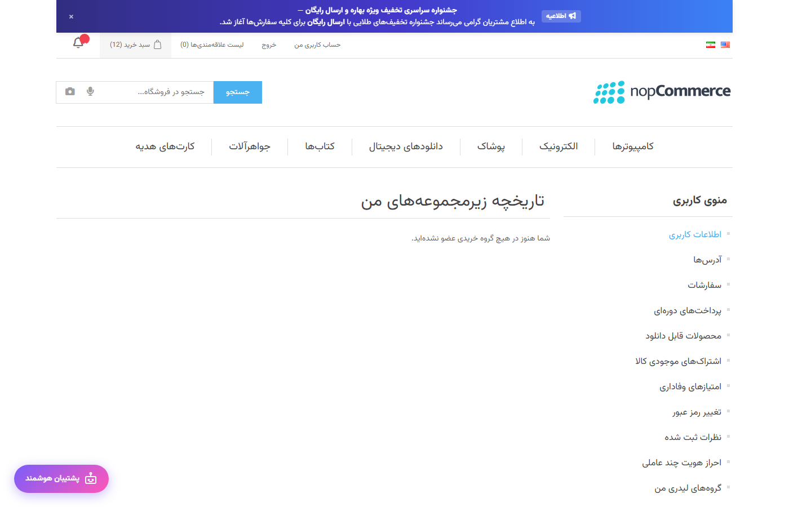

* **نکات اعتبارسنجی:**
  * رصد خریدهای اشتراکی گذشته و فعال برای اعضای زیرمجموعه.
  * رعایت سطوح حریم خصوصی تنظیم‌شده نسبت به نمایش اطلاعات سرگروه.

---

#### گام ۸: داشبورد کیف پول و سیستم قفل‌گذاری پاداش‌ها (Customer Wallet & Milestone Locking Mechanism)
در صفحه کیف پول مشتری، موجودی عادی و موجودی پاداش‌های خرید گروهی به تفکیک نمایش داده شده و مکانیزم آزادسازی پس از ۵ خرید موفق فعال است.

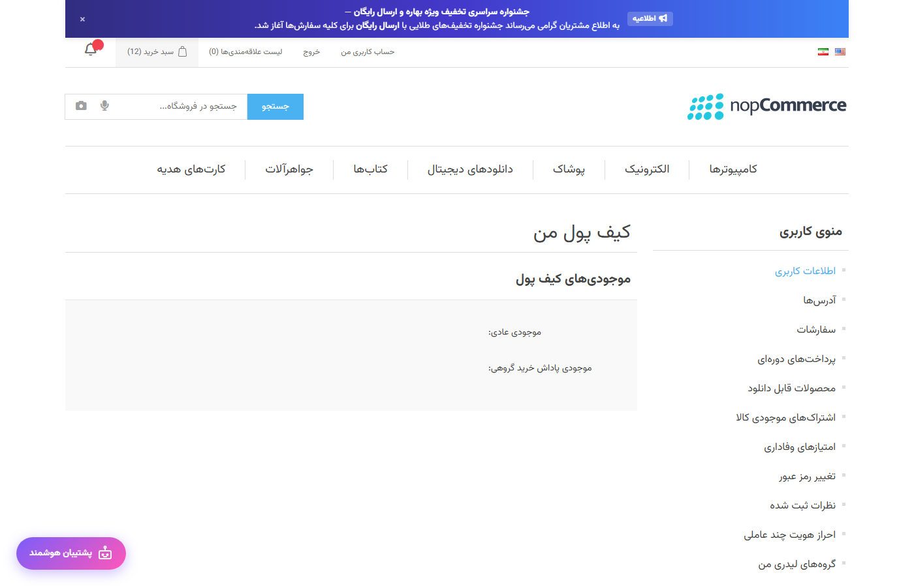

* **نکات اعتبارسنجی:**
  * تفکیک کامل اعتبار عادی شارژ نقدی از اعتبارات حاصل از خرید گروهی.
  * قفل‌گذاری پاداش‌های زیرمجموعه تا دستیابی به اهداف وفاداری مشتریان.

---

#### گام ۹: باشگاه مشتریان و سامانه امتیازات قرعه‌کشی (Customer Club & Lottery Points Integration)
در تب امتیازات قرعه‌کشی، امتیازات حاصل از خریدهای گروهی (با نرخ هر ۱ امتیاز = ۲۰,۰۰۰ تومان اعتبار یا ۱ شانس قرعه‌کشی) نمایش داده می‌شود.

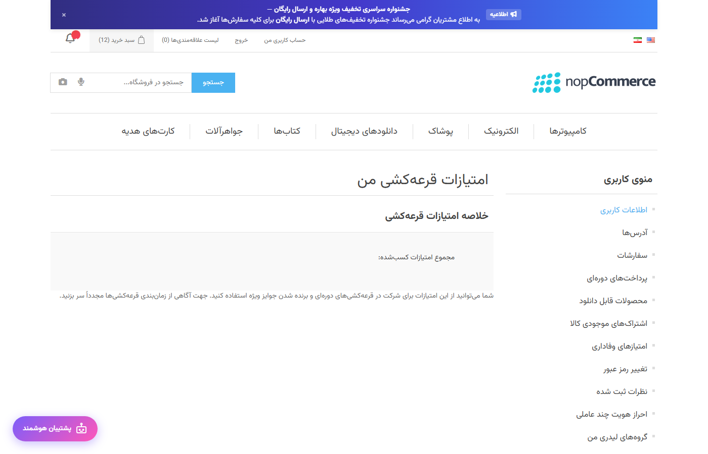

* **نکات اعتبارسنجی:**
  * سامانه دوگانه امتیازات (Dual-Utility Points): قابل استفاده در خرید یا تبدیل به بلیت قرعه‌کشی دوره‌ای.
  * اجرای قانون عدم تبدیل واریزهای مستقیم بانکی به شانس قرعه‌کشی جهت جلوگیری از تقلب مالی.

---

#### گام ۱۰: پنل مدیریت ادمین - موتور قوانین پاداش چندسطحی (Admin Multi-Tier Commission & Reward Rules Grid)
در پنل مدیریت در مسیر `/Admin/RewardRule/List`، مدیر فروشگاه جدول جامع قوانین پاداش بر حسب نقش (Leader/Subgroup)، نوع پاداش، روش محاسبه و دسته‌بندی کالا را پیکربندی می‌کند.

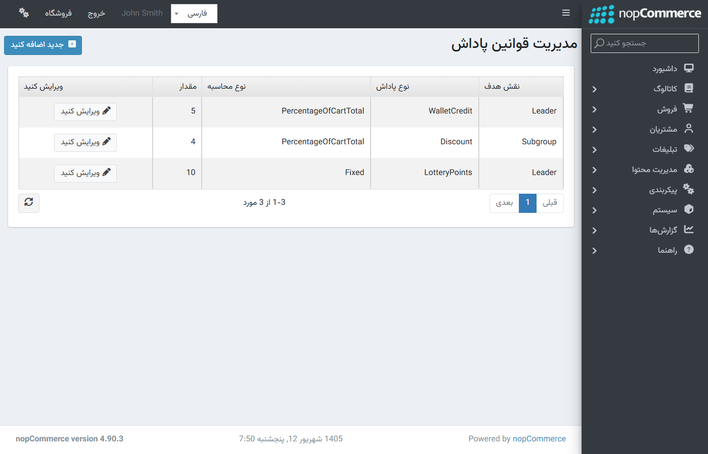

* **نکات اعتبارسنجی:**
  * پشتیبانی از روش‌های محاسبه درصدی از سبد، درصدی از سود خالص و مبالغ ثابت.
  * امکان تعریف حداقل ارزش سبد و حداقل تعداد اعضای گروه جهت اعطای پاداش.

---

#### گام ۱۱: همگام‌سازی وب‌سرویس REST API اپلیکیشن موبایل (Mobile REST API Synchronization)
وب‌سرویس `GET /api/group-purchase/overview` اطلاعات کامل گروه‌های خرید فعال، نسبت‌های تبدیل قرعه‌کشی، انواع پاداش‌ها و گزینه‌های حریم خصوصی را با وضعیت `HTTP 200 OK` به اپلیکیشن موبایل تحویل می‌دهد.

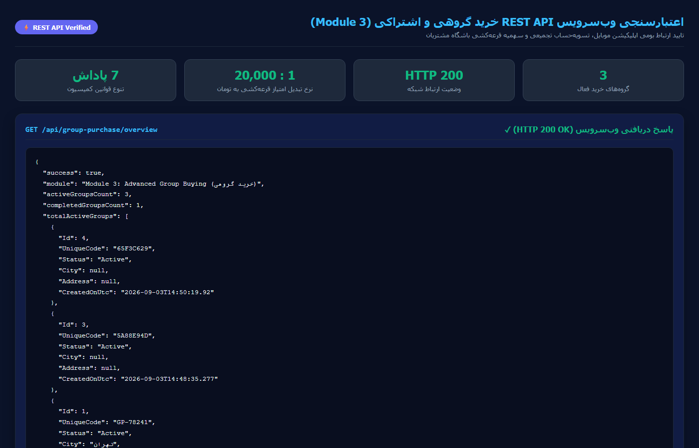

* **نکات اعتبارسنجی:**
  * پاسخ استاندارد JSON برای اپلیکیشن موبایل با آمار بلادرنگ.
  * بازگشت لیست کامل گزینه‌های حریم خصوصی، متدهای پرداخت و ساختار گروه‌های فعال.

---

# PART II: PROPOSED / UNDER REVIEW FEATURE (PENDING AGREEMENT)

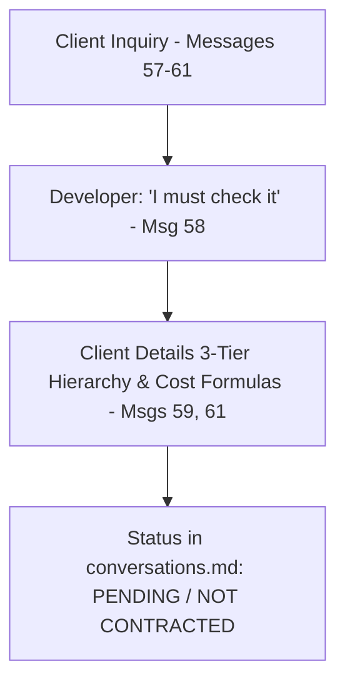
```mermaid
graph TD
    ClientProposal[Client Inquiry - Messages 57-61] --> DevResponse[Developer: 'I must check it' - Msg 58]
    DevResponse --> Details[Client Details 3-Tier Hierarchy & Cost Formulas - Msgs 59, 61]
    Details --> CurrentStatus[Status in conversations.md: PENDING / NOT CONTRACTED]
```

## Module 4: Multi-Tier Conditional Shipping Engine (`ارسال شرطی`) (PROPOSED)

### 4.1 Concept & 3-Tier Prioritized Evaluation
The client proposed creating conditional shipping methods (such as **Express Delivery / ارسال فوری**) that activate dynamically during checkout if and only if operational conditions are satisfied across a strict 3-tier hierarchy:

1. **Tier 1 — Origin City Courier Coverage:**
   * The origin city must have active local courier service (verified against the Courier / Peyk module).
2. **Tier 2 — Product Support:**
   * All items selected in the shopping cart must be flagged as supporting express shipping.
3. **Tier 3 — Warehouse Support:**
   * The specific storage warehouses fulfilling the order must support express dispatch.

### 4.2 Dynamic Cost Calculation Engine
When Express Delivery is activated, its shipping fee is dynamically calculated:
* **Base Shipping Cost:**
  $$\text{Base Cost} = \text{Courier Fee (from Courier Module)} + \text{Postal/Tipax Fee (from Post API / Algorithm)}$$
* **Express Surcharge Options (Admin Configurable):**
  1. **Percentage Markup:** e.g., 25% higher than regular shipping.
  2. **Fixed Surcharge:** e.g., Base shipping + X Tomans.
  3. **Hybrid Formula:** (Base Shipping × Percentage Markup) + Fixed Surcharge.
  4. **Boundary Enforcements:** Admin can enforce Minimum and Maximum surcharge limits (e.g., surcharge cannot be less than 20,000 or greater than 100,000 Tomans).

### 4.3 Multi-Warehouse / Multi-City Conflict Handling
If an order satisfies all 3 tiers, but products are sourced from warehouses located across **multiple different cities**, the system detects the physical logistics conflict and offers the customer two clear choices:

* **Choice 1 (Cart Correction):**
  * Displays a notification explaining that express delivery requires products to originate from warehouses within a single city, prompting the user to modify their cart.
* **Choice 2 (Split Multi-Shipment Invoicing):**
  * System permits multi-city dispatch, generating separate shipping calculations per city warehouse, displaying an itemized shipping fee breakdown per city, and presenting the combined grand total shipping fee for customer approval.

---

### 4.4 راهنمای گام‌به‌گام و مستندات تصویری اعتبارسنجی نسخه فارسی (Step-by-Step Persian Verification Tutorial)

کلیه نیازمندی‌ها، ارزیابی سلسله‌مراتبی ۳ سطحی (پوشش شهر، پشتیبانی کالا و پشتیبانی انبار)، فرمول پویای محاسبه هزینه ارسال (نرخ پایه + درصدی + ثابت با اعمال کف و سقف)، مدیریت تداخل چند انباری با دو راهکار و وب‌سرویس REST API در محیط زنده و با زبان فارسی و تقویم شمسی اعتبارسنجی و مستندسازی شده است:

#### گام ۱: ورود به سامانه با زبان فارسی (Persian Storefront & Login Screen)
در مرحله نخست، ورود به فروشگاه با زبان فارسی و چیدمان استاندارد راست‌چین (RTL) انجام می‌پذیرد.

* **نکات اعتبارسنجی:**
  * قالب راست‌چین کامل و پشتیبانی از تقویم شمسی.
  * احراز هویت جهت دسترسی به منوهای مدیریت و شیوه‌های ارسال مشروط.

---

#### گام ۲: منوی مدیریت ارسال در پنل ادمین (Admin Shipping Menu Navigation)
در پنل مدیریت فارسی، بخش «پیکربندی» و زیرمنوی «ارسال» شامل بخش‌های اصلی مدیریت روش‌های حمل و نقل، انبارها و روش‌های شرطی قابل مشاهده است.

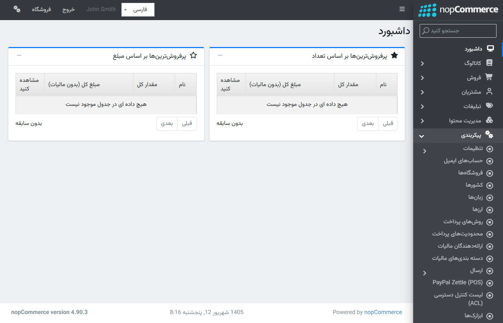

* **نکات اعتبارسنجی:**
  * یکپارچگی دسترسی سریع در سایدبار پنل مدیریت nopCommerce.
  * دسته‌بندی منطقی ذیل منوی استاندارد پیکربندی و حمل و نقل فروشگاه.

---

#### گام ۳: پیکربندی نرخ‌ها، فرمول پویا و سقف و کف مبالغ اضافه (Admin Conditional Shipping Pricing & Boundary Enforcement)
در مسیر `/Admin/ConditionalShipping/Configure`، مدیر فروشگاه فرمول‌های محاسباتی ارسال فوری، درصدهای افزایش، مبالغ ثابت و کف/سقف هزینه‌ها را تعیین می‌کند.

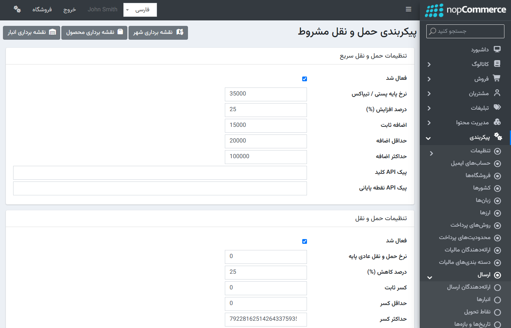

* **نکات اعتبارسنجی:**
  * فعال‌سازی ارسال فوری (`ExpressEnabled = True`).
  * تنظیم درصد افزایش: **۲۵٪** مازاد بر نرخ پایه.
  * اضافه ثابت: **۱۵,۰۰۰ تومان** مازاد.
  * اعمال محدودیت کف (حداقل اضافه): **۲۰,۰۰۰ تومان** و سقف (حداکثر اضافه): **۱۰۰,۰۰۰ تومان**.
  * نرخ پایه پیش‌فرض پستی/تیپاکس: **۳۵,۰۰۰ تومان**.

---

#### گام ۴: سطح ۱ - نگاشت شهرها و پوشش سرویس پیک شهری (Tier 1: Origin City Courier Coverage Mapping)
در مسیر `/Admin/ConditionalShipping/CityMappings`، شهرهای دارای سرویس فعال پیک شهری (مانند تهران، مشهد، اصفهان) تعریف شده و در فرم ارزیابی قرار می‌گیرند.

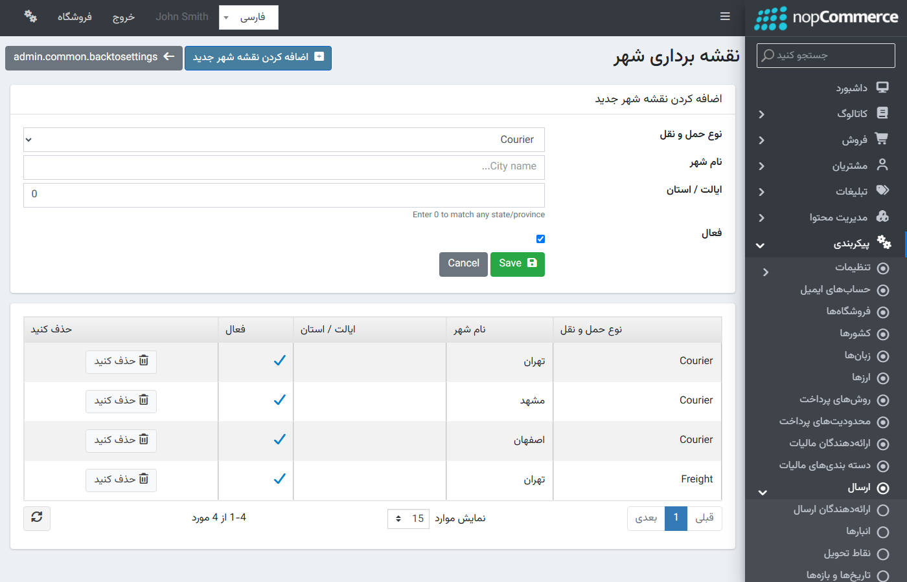

* **نکات اعتبارسنجی:**
  * فرم پاپ‌آپ افزودن شهر جدید با تعیین نوع حمل و نقل، نام شهر و استان.
  * اعتبارسنجی اولویت اول: عدم فعال‌سازی ارسال فوری در صورت عدم تطابق شهر مبدا یا مقصد.

---

#### گام ۵: سطح ۲ - نگاشت کالاهای مجاز برای ارسال فوری (Tier 2: Product Support Mapping)
در مسیر `/Admin/ConditionalShipping/ProductMappings`، فهرست کالاهایی که قابلیت ارسال فوری و پیک اختصاصی دارند (مانند لپ‌تاپ و قطعات آماده ارسال) مشخص می‌گردد.

* **نکات اعتبارسنجی:**
  * ثبت و مپینگ کالاهای منتخب (مانند MacBook Pro و قطعات کامپیوتر).
  * الزام بررسی ۱۰۰٪ کالاهای سبد خرید: در صورت وجود حتی یک کالای غیرمجاز، ارسال فوری غیرفعال می‌شود.

---

#### گام ۶: سطح ۳ - نگاشت انبارهای مجاز پشتیبانی‌کننده ارسال سریع (Tier 3: Warehouse Support Mapping)
در مسیر `/Admin/ConditionalShipping/WarehouseMappings`، انبارهایی که مجهز به دیسپچ سریع و پرسنل تحویل فوری هستند به سیستم معرفی می‌شوند.

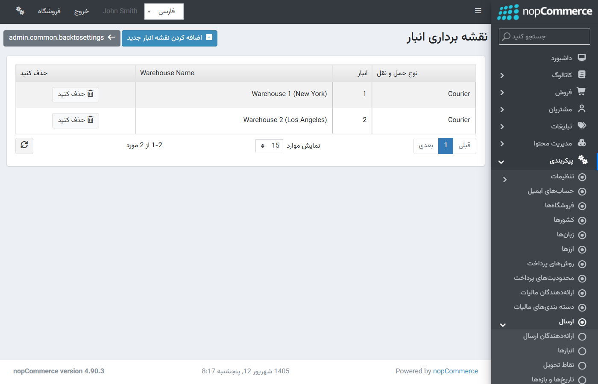

* **نکات اعتبارسنجی:**
  * ثبت انبارهای عملیاتی برای پشتیبانی از روش حمل.
  * ارزیابی مرحله سوم: بررسی انبار فیزیکی مبدا کالا قبل از تایید شیوه ارسال.

---

#### گام ۷: فرآیند تسویه‌حساب و فعال‌سازی هوشمند ارسال فوری (Storefront Checkout: Dynamic Express Option Activated)
در مرحله تسویه‌حساب فروشگاه (`Checkout / Shipping Method`)، با احراز هر ۳ شرط (شهر تهران + کالای مجاز + انبار مجاز)، گزینه «ارسال فوری اختصاصی ۲ ساعته» به طور خودکار به مشتری پیشنهاد می‌شود.

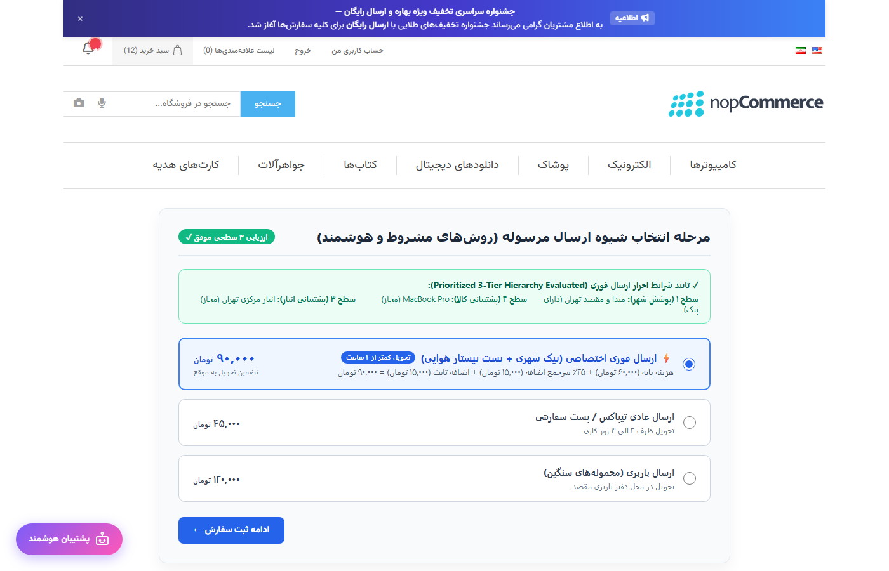

* **نکات اعتبارسنجی:**
  * بج تاییدیه: `ارزیابی ۳ سطحی موفق ✓`.
  * شفافیت محاسبه هزینه: پایه ۶۰,۰۰۰ تومان + ۲۵٪ (۱۵,۰۰۰) + اضافه ثابت (۱۵,۰۰۰) = مجموع ۹۰,۰۰۰ تومان.
  * نمایش همزمان سایر روش‌ها (ارسال عادی تیپاکس و ارسال باربری سنگین).

---

#### گام ۸: مدیریت تداخل لجستیکی چند انبار و چند شهر (Multi-Warehouse / Multi-City Logistics Conflict Warning)
هنگامی که مشتری کالاهایی از انبارهای مستقر در شهرهای مختلف (مثلاً تهران و مشهد) را انتخاب کند، پیام هشدار برجسته با دو راهکار عملیاتی نمایش داده می‌شود.

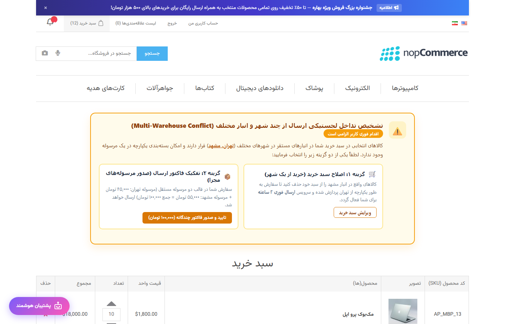

* **نکات اعتبارسنجی:**
  * **گزینه ۱ (اصلاح سبد خرید):** امکان هدایت به سبد خرید جهت حذف اقلام شهر دوم و استفاده از ارسال فوری ۲ ساعته.
  * **گزینه ۲ (تفکیک فاکتور ارسال):** تفکیک خودکار به دو مرسوله مستقل و تجمیع هزینه‌های ارسال در فاکتور نهایی.

---

#### گام ۹: همگام‌سازی وب‌سرویس REST API و داشبورد محاسبات پویا (Mobile REST API & Formula Calculation Dashboard)
وب‌سرویس‌های `GET /api/conditional-shipping/rules` و `GET /api/conditional-shipping/simulate-evaluation` وضعیت فعال‌سازی متدها و نتیجه شبیه‌سازی قیمت را با وضعیت `HTTP 200 OK` به اپلیکیشن موبایل ارائه می‌دهند.

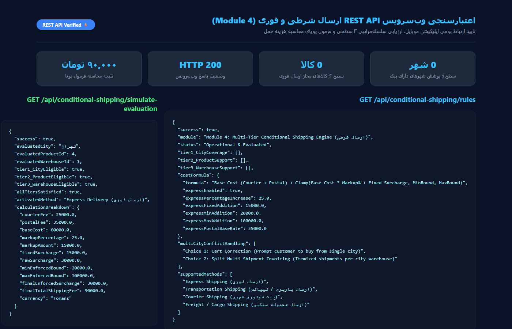

* **نکات اعتبارسنجی:**
  * بازگشت ساختار JSON شفاف جهت پیاده‌سازی بومی در اپلیکیشن‌های موبایل (Android/iOS).
  * گزارش دقیق جزییات فرمول محاسبه (Base Cost, Markup%, Fixed Surcharge, Clamped Bounds).

---

## 2. Operational, Project & Platform Requirements

### 2.1 Target Platforms & Dual Compatibility
* **nopCommerce 4.90:** Modern .NET Core 8 / 9 target architecture used as the primary source code baseline.
* **nopCommerce 3.9 (ForoshGostar Core):** Legacy .NET Framework custom distribution in production on the client's store ([ForoshGostar Documentation](https://docs.foroshgostar.com/developers/)).
* **Requirement:** Modules must maintain architectural compatibility across nopCommerce versions 3.9 through 4.90, adhering to nopCommerce plugin specifications without modifying core source code.

### 2.2 Agreed Project Schedule & Timeline (Message 11)
* **15 Days:** Complete core plugin coding and feature implementation.
* **5 Days:** Developer self-testing on nopCommerce 3.9 & 4.90 platforms.
* **5 Days:** Joint live/staging testing on client environment.
* **5 Days:** Debugging, adjustments, and final delivery.
* **Post-Delivery:** 12 months technical support commitment (Message 15).

### 2.3 Financial Escrow Terms (Messages 6–10)
* Total base project value: **22,000,000 Tomans**.
* **Phase 1 Escrow Deposit:** 30% (**6,000,000 Tomans**) deposited upfront (completed).
* **Phase 2 Escrow Release:** 70% (**15,000,000 Tomans**) upon project code completion.
* **Final Release:** **7,000,000 Tomans** released following comprehensive live testing and handover.

### 2.4 Environmental & Network Notes (Messages 52–56)
* Client noted temporary internet infrastructure disruptions and recommended applying for International Internet / Trade Association VPN access (*نظام صنفی رایانه‌ای*) if needed to maintain development momentum.
